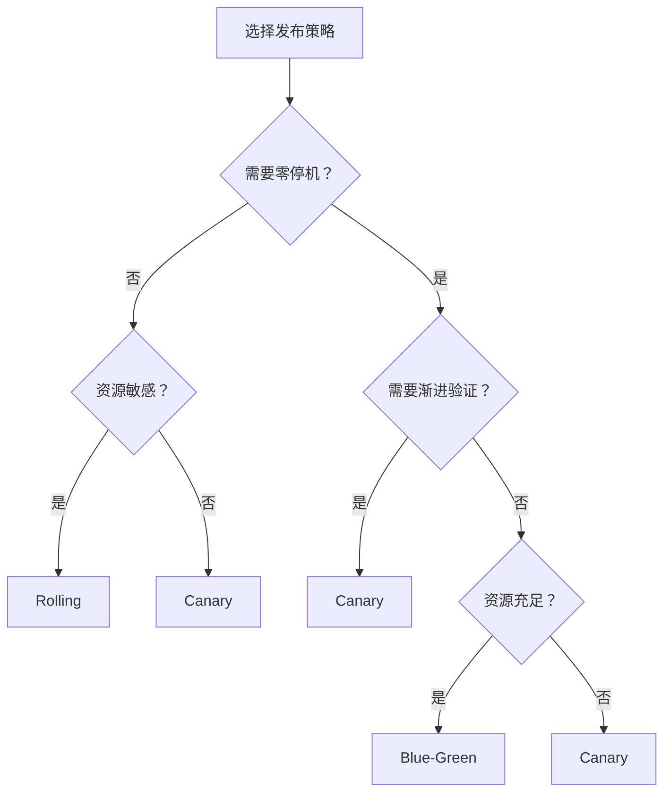

# 🚀 持续交付（CD）

GitOps  OCI Bundle  Traffic Control

代码构建成镜像后，怎么安全地部署到生产环境？DevFlow 提供了三种发布策略，让你根据业务重要程度选择合适的方式。

---

## 🚦 三种发布策略

DevFlow 支持三种发布方式。你可以把它们理解为三种不同的"过马路方式"：

| 🚀 策略 | 💡 怎么理解 | 🎯 适合什么 |
|------|---------|---------|
| **Rolling** | 一步一步慢慢走 | 普通服务，对风险容忍度较高 |
| **Canary** | 先伸一只脚试探，没问题再走 | 核心服务，需要控制风险 |
| **Blue-Green** | 走天桥，旧路和新路并行，随时可以退回来 | 关键业务，必须零停机 |

---

## 🛞 Rolling — 滚动更新

**最简单直接的方式。**

Kubernetes 逐步创建新版本 Pod，同时销毁旧版本 Pod。就像换轮胎，一个一个换，车一直在跑。

**优点**：
- 资源占用最低（最多同时多跑 25% 的 Pod）
- 不需要额外的组件（Istio、Argo Rollouts）
- 实现最简单

**缺点**：
- 回滚慢（要重新 Rollout 一遍）
- 发布过程中出问题，影响所有用户

**适合**：内部工具、后台管理、资源敏感的服务。

---

## 🐤 Canary — 灰度发布

**先让一小部分用户试用新版本。**

通过 Istio 流量控制，先把 10% 的流量切到新版本，观察 5 分钟。指标正常就扩大到 30%、50%，最后 100%。

就像新菜品上市，先给 VIP 客人试吃，反馈好再全员推广。

**优点**：
- 风险可控，出问题只影响少量用户
- 回滚极快（秒级切回旧版本流量）
- 可以基于真实用户流量验证新版本

**缺点**：
- 需要 Istio + Argo Rollouts
- 资源占用中等（新旧版本同时运行）

**适合**：核心 API、支付系统、用户-facing 的前端服务。

---

## 🔵🟢 Blue-Green — 蓝绿部署

**两套实例并行，瞬时切换。**

同时维护旧版本（Blue）和新版本（Green）。新版本先在 Preview 环境里验证，没问题就一键把流量切过去。就像走天桥，旧路和新路同时在，随时可以退回来。

**优点**：
- 真正的零停机
- 回滚最快（瞬时切回）
- 适合数据库 schema 变更

**缺点**：
- 资源成本最高（双倍实例）
- 需要 Argo Rollouts

**适合**：金融核心、关键交易、必须零停机的业务。

---

## 🧭 怎么选

**简单口诀**：
- 不怕停 → Rolling
- 怕停但资源紧 → Canary
- 绝对不能停 → Blue-Green

---

## 🗂️ 文档导航

| 📄 文档 | 📝 内容 |
|------|------|
| [CD 架构](architecture/) | DevFlow 怎么和 Argo CD、Istio 配合 |
| [发布策略选型](standard/) | 三种策略的深度对比 |
| [Rolling 发布](rolling/) | 原理图 + 详细流程 |
| [Canary 发布](canary/) | 原理图 + 详细流程 + YAML 配置 |
| [Blue-Green 发布](blue-green/) | 原理图 + 详细流程 + YAML 配置 |
| [组件矩阵](component/) | CD 用到的所有组件 |
