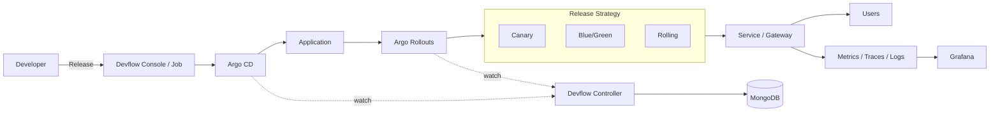

# 🏗️ CD 架构图（Architecture）

下面是 CD 核心发布链路与控制闭环的整体关系图。

## 🗺️ Mermaid 版

## ✅ 关键说明

- **触发**：Devflow Console / Job 创建并驱动发布流程
- **发布**：Rollouts 负责策略执行（Canary / Blue-Green / Rolling）
- **闭环**：Controller 监听状态回写 Mongo，形成可观测发布闭环
- **验证**：发布过程依赖指标与链路进行自动或人工决策
