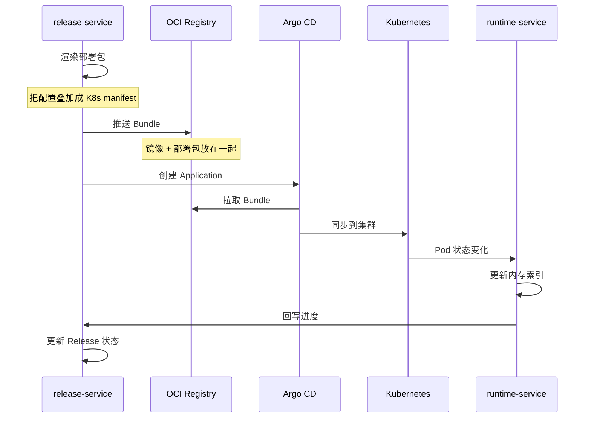

# 🚀 CD 架构

DevFlow 的 CD 不直接操作 Kubernetes，而是通过 **GitOps** 模式工作：release-service 生成部署包，推送到仓库，Argo CD 负责实际部署。

CD 这一层的另一个关键设计是：**发布步骤本身不是写死在 release-service 代码里的，而是由 Tekton task 和发布流水线配置组合出来的。**

这意味着 operator 可以通过增减 task、调整 task 顺序、插入校验或观测步骤，去改变整个发布过程，而不必改 release-service 的核心实现。
release-service 负责的主要是状态机、冻结事实和回写契约，真正“怎么发布”尽量交给流水线编排。

---

## 🧠 为什么用 GitOps

传统的部署方式是"告诉 K8s 该怎么做"，DevFlow 的方式是"告诉 Argo CD 期望状态是什么，让它自己同步"。

好处：
- **可追溯** — 每次部署的配置都在版本控制里
- **可回滚** — Argo CD 保留了历史同步记录
- **安全** — DevFlow 不直接操作 K8s，降低了风险

---

## 🔄 数据流

```mermaid
sequenceDiagram
    participant Release as release-service
    participant Registry as OCI Registry
    participant Argo as Argo CD
    participant K8s as Kubernetes
    participant Runtime as runtime-service

    Release->>Release: 渲染部署包
    Note over Release: 把配置叠加成 K8s manifest
    Release->>Registry: 推送 Bundle
    Note over Registry: 镜像 + 部署包放在一起
    Release->>Argo: 创建 Application
    Argo->>Registry: 拉取 Bundle
    Argo->>K8s: 同步到集群
    K8s->>Runtime: Pod 状态变化
    Runtime->>Runtime: 更新内存索引
    Runtime->>Release: 回写进度
    Release->>Release: 更新 Release 状态
```

---

## 关键组件的分工

| 组件 | 做什么 | 不做什么 |
|------|--------|---------|
| **release-service** | 渲染配置、推送包、创建 Argo CD Application | 不直接操作 K8s |
| **Argo CD** | 从仓库拉包、同步到 K8s、监控健康状态 | 不参与配置渲染 |
| **Argo Rollouts** | 管理 Canary / Blue-Green 的渐进式发布 | 不参与 GitOps 同步 |
| **Istio** | 控制流量分配（权重、切换） | 不管理 Pod 生命周期 |
| **runtime-service** | 观察状态、回写进度 | 不参与部署决策 |

---

## 🆚 与旧架构的区别

DevFlow 早期版本是直接操作 K8s 的，现在改成了 GitOps：

| | 旧架构 | 新架构 |
|--|--------|--------|
| 发布控制 | devflow-controller 直接改 K8s | release-service + Argo CD |
| 状态存储 | MongoDB | PostgreSQL + 内存索引 |
| 部署包存储 | MongoDB GridFS | OCI Registry |
| 回滚方式 | 手动改 K8s | Argo CD 历史同步 |

GitOps 让发布过程更安全、更可追溯。
