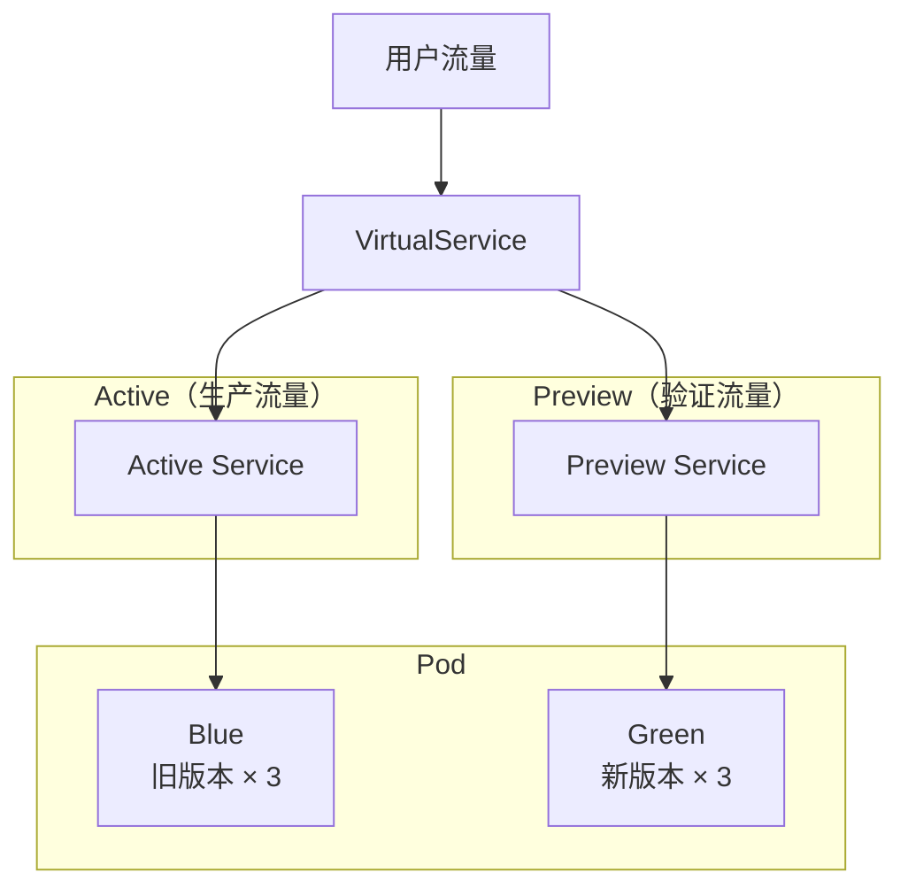

# 🔵🟢 Blue-Green 发布

<span class="df-badge">Zero Downtime</span> <span class="df-badge">Preview</span> <span class="df-badge">Fast Rollback</span>

**Blue-Green（蓝绿部署）** 是最稳妥的发布方式。它同时维护两套完整实例，验证通过后瞬时切换流量。就像走天桥，旧路和新路同时在，随时可以退回来。

---

## 🎯 适合什么场景

- 金融核心、关键交易
- 必须零停机的业务
- 数据库 schema 变更

---

## 🧠 原理



- **Active Service** 接收生产流量，始终指向当前稳定版本
- **Preview Service** 接收验证流量，用于测试新版本

---

## 🚦 发布过程

### 阶段 1：部署新版本

```
Active → Blue(旧, 3 Pod)   ← 生产流量
Preview → Green(新, 3 Pod) ← 验证流量
```

Green 部署完成，可以通过 Preview Service 访问验证。

### 阶段 2：预验证

对 Green 跑自动化测试，确认新版本功能正常。

### 阶段 3：切换

一键切换 Active Service 指向 Green：

```
Active → Green(新, 3 Pod)  ← 生产流量（瞬时切换）
Preview → Blue(旧, 3 Pod)  ← 保留备回滚
```

### 阶段 4：后验证

全量流量切换后，继续观察核心指标。

### 阶段 5：缩容旧版本

确认稳定后，销毁 Blue 实例。

---

## 回滚

Blue-Green 的回滚最快：

```
出问题 → Active Service 指回 Blue → 秒级完成
```

而且 Green 仍然保留在 Preview 上，方便排查问题。

---

## 优缺点

| ✅ 优点 | ❌ 缺点 |
|---------|---------|
| 真正的零停机 | 资源成本最高（双倍实例）|
| 回滚最快（瞬时） | 需要 Argo Rollouts |
| 发布前后可完全对比 | 数据库变更需配合迁移脚本 |
| 适合数据库 schema 变更 | |

---

## 一句话总结

Blue-Green 就是"双保险" — 最安全、最稳妥，适合绝对不能出问题的关键业务。
