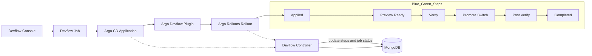

# 云原生 Blue/Green 发布实战：Argo CD + Argo Rollouts

Blue/Green 发布是一种低风险的发布策略，通过维护两套环境（Blue 和 Green），在新版本发布时切换流量到新环境，实现平滑切换和快速回滚。

---

## 1. 技术栈说明

| 组件 | 作用 | 说明 |
|------|------|------|
| **Argo CD** | GitOps CD 平台 | 自动同步 Kubernetes 资源与 Git 仓库，实现声明式部署 |
| **Argo Rollouts** | 发布控制器 | 提供 Blue/Green、Canary 等高级发布策略，并支持指标分析与自动回滚 |
| **Service / Ingress** | 流量控制 | Kubernetes Service 或 Ingress 实现流量切换 |
| **Prometheus / Metrics** | 指标监控 | 可用于自动判断新版本健康并触发切换 |

---

## 2. 基本原理

1. **Blue/Green 环境**：
   - **Blue**：当前生产环境版本
   - **Green**：新版本环境，准备上线
2. **流量切换**：
   - Service 指向 Blue 环境
   - Rollout 创建 Green Pod 后，通过 Service 将流量切换到 Green
3. **回滚**：
   - 如果 Green 出现问题，Service 可以快速切回 Blue
4. **Argo CD**：
   - GitOps 同步 Blue/Green Rollout 的 Manifest，实现自动化部署和版本管理

---

## 2.1 Devflow Blue/Green 发布流程图（示例）



说明：

- 发布链路：Devflow Console 触发 Job，生成 Argo CD Application，经插件下发 Blue/Green Rollout。
- 控制闭环：Devflow Controller 同时监听 Application 与 Rollout 状态，回写 Mongo 的 `steps` 与 `job status`。
- Blue/Green 节奏：Preview 验证通过后再 Promote 切流，完成后进入 Completed。

---

## 3. Rollout 配置示例

```yaml
apiVersion: argoproj.io/v1alpha1
kind: Rollout
metadata:
  name: my-app
  namespace: production
spec:
  replicas: 5
  strategy:
    blueGreen:
      activeService: my-app-active
      previewService: my-app-preview
      autoPromotionEnabled: false # 手动切换流量
  selector:
    matchLabels:
      app: my-app
  template:
    metadata:
      labels:
        app: my-app
    spec:
      containers:
      - name: my-app
        image: registry.example.com/my-app:v2
```

## 步骤

#### 1. 概述

Blue/Green 发布是一种通过同时运行两套版本（Blue 为当前稳定版本，Green 为新版本），
并通过 **Service 原子切换**完成发布的策略。

在 Argo Rollouts 中，Blue/Green 发布依赖以下核心对象：

- Rollout
- ReplicaSet
- activeService
- previewService
- Analysis（可选）

---

#### 2. 核心对象说明

##### 2.1 activeService

- 对外提供正式生产流量
- 始终指向当前稳定版本的 ReplicaSet

##### 2.2 previewService

- 用于新版本验证
- 只接收测试或预览流量

##### 2.3 ReplicaSet

- 每一次 Pod Template 变更都会生成新的 ReplicaSet
- 用于实现版本隔离

---

#### 3. 发布前状态（Steady State）

- Rollout 处于 Fully Promoted 状态
- 当前稳定版本为 Revision 1
- activeService 和 previewService 均指向 Revision 1
- 无发布进行中

---

#### 4. Blue/Green 发布步骤

##### Step 1：触发更新

- 用户修改 `spec.template`
- Argo Rollouts 检测到变更
- 创建新的 ReplicaSet（Revision 2）
- 初始副本数为 0

---

##### Step 2：切换 Preview Service

- previewService 的 selector 更新
- previewService 指向 Revision 2
- activeService 仍指向 Revision 1

---

##### Step 3：扩容 Green 副本

- Revision 2 ReplicaSet 被扩容
- 副本数为：
  - `spec.replicas`，或
  - `previewReplicaCount`（如配置）
- 等待 Pod Ready

---

##### Step 4：Pre-Promotion Analysis（可选）

- 当 Revision 2 Pod Ready 后触发
- 常用于校验：
  - 成功率
  - 延迟
  - 错误率
  - 业务指标

---

##### Step 5：发布暂停（可选）

满足以下条件之一时，Rollout 会暂停：

- `autoPromotionEnabled: false`
- 配置了 `autoPromotionSeconds`

恢复方式：

- 人工 Resume
- 或超时自动继续

---

##### Step 6：正式发布（Promotion）

- activeService selector 更新
- activeService 从 Revision 1 切换到 Revision 2
- 所有生产流量切到新版本

---

##### Step 7：Post-Promotion Analysis（可选）

- 切流完成后执行
- 用于验证真实生产流量下的稳定性

---

##### Step 8：发布完成

- Revision 2 被标记为 Stable
- Rollout 状态变为 Healthy
- 发布流程结束

---

##### Step 9：旧版本缩容

- 等待 `scaleDownDelaySeconds`（默认 30 秒）
- Revision 1 ReplicaSet 被缩容至 0

---

#### 5. 回滚机制

##### 5.1 人工回滚

- 修改 Rollout 镜像版本
- 或将 activeService 指回旧 ReplicaSet

##### 5.2 自动回滚

- Analysis 失败
- Rollout 中止发布
- activeService 保持指向旧版本

---

#### 6. 关键配置参数

| 参数 | 说明 |
|-----|-----|
| activeService | 正式流量 Service |
| previewService | 预览流量 Service |
| previewReplicaCount | 预览副本数 |
| autoPromotionEnabled | 是否自动切流 |
| autoPromotionSeconds | 延迟自动切流 |
| scaleDownDelaySeconds | 旧版本保留时间 |
| prePromotionAnalysis | 切流前分析 |
| postPromotionAnalysis | 切流后分析 |

---

#### 7. Blue/Green 特点

##### 优点

- Service 原子切换
- 回滚速度极快
- 新旧版本完全隔离
- 发布流程清晰

##### 缺点

- 发布期间资源占用翻倍
- 不支持渐进式流量验证

---

#### 8. 适用场景

- 核心业务系统
- 对回滚时间要求极高的系统
- 不适合做流量比例控制的场景

---

#### 9. 总结

Argo Rollouts 的 Blue/Green 发布本质是：

- 使用 ReplicaSet 实现版本隔离
- 使用 Service selector 实现原子切流
- 使用 Analysis 实现发布质量控制
