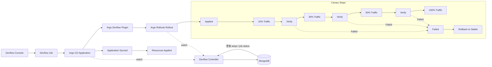

# 🐤 云原生 Canary 发布实战：Argo CD + Argo Rollouts + Istio

Canary 发布是将新版本的流量逐步引入生产环境的一种发布策略，用于 **降低风险、快速回滚、灰度验证**。在 Kubernetes 环境下，结合 Argo CD、Argo Rollouts 和 Istio 可以实现全自动化 Canary 发布。

---

## 🧩 1. 技术栈说明

| 组件 | 作用 | 说明 |
|------|------|------|
| **Argo CD** | GitOps CD 平台 | 自动同步 Kubernetes 资源与 Git 仓库，实现声明式部署 |
| **Argo Rollouts** | 发布控制器 | 提供 Canary、Blue/Green、实验性发布策略，并与服务网格集成 |
| **Istio** | 服务网格 | 流量管理、路由控制、指标采集，实现按比例灰度流量 |
| **Prometheus / Metrics** | 指标监控 | 用于自动判断 Canary 健康和触发回滚 |

---

## 🔍 2. 基本原理

1. **Argo CD** 负责将应用 Manifest（Deployment、Service、Rollout 等）同步到集群。
2. **Argo Rollouts** 替代原生 Deployment，对 Pod 版本的发布进行控制（如逐步增量）。
3. **Istio VirtualService / DestinationRule** 控制请求流量，将部分流量导向 Canary Pod。
4. **Metrics & Analysis**：Rollouts 可以根据指标（如错误率、延迟）自动判断 Canary 是否健康。
5. **回滚 / 推进**：
   - 如果指标正常，Rollout 自动增加新版本流量直至 100%。
   - 如果异常，Rollout 自动回滚到旧版本。

---

---

## 🗺️ 2.1 Devflow Canary 发布流程图（示例）

说明：

- 发布链路：Devflow Console 触发 Job，生成 Argo CD Application，经插件下发 Rollout。
- 控制闭环：Devflow Controller 同时监听 Application 与 Rollout 状态，回写 Mongo 的 `steps` 与 `job status`。
- 灰度节奏：Applied → 10% → Verify → 30% → Verify → 50% → Verify → 100%。

---

## 🧭 2.2 端到端步骤（Devflow 驱动）

1. **Devflow 创建 Application 成功**  
   - Devflow Job 创建 Argo CD Application  
   - Application 进入 `Synced`（不一定 `Healthy`）

2. **Argo CD 同步并创建/更新资源成功**  
   - Argo CD 监听到 Application 变更  
   - 生成/更新 Rollout、Service、VirtualService 等资源  

3. **Rollout 创建成功并进入灰度**  
   - Devflow Controller 监听 Rollout 状态  
   - 持续更新 `steps` 与 `job status`：
     - 10% → Verify（成功）
     - 30% → Verify（成功）
     - 50% → Verify（成功）
     - 100% → Completed
   - 若新版本 Pod 启动失败（如 NotReady / CrashLoopBackOff），对应 Verify 进入 `Failed` 并触发回滚

> 若任一步 Verify 失败，Controller 标记对应阶段失败并触发回滚流程（按策略自动或人工介入）。

---

## 📋 2.3 Canary Steps / Status 对照表

| Step | 状态（Status） | 触发事件 / 说明 |
|------|----------------|----------------|
| Applied | Running → Succeeded/Failed | Application 创建并 Sync 成功 |
| 10% Traffic | Running → Succeeded | 切流 10% 完成 |
| Verify | Running → Succeeded / Failed | 指标通过或 Pod 启动正常 / Pod NotReady 或 CrashLoopBackOff |
| 30% Traffic | Running → Succeeded | 切流 30% 完成 |
| Verify | Running → Succeeded / Failed | 指标通过或 Pod 启动正常 / Pod NotReady 或 CrashLoopBackOff |
| 50% Traffic | Running → Succeeded | 切流 50% 完成 |
| Verify | Running → Succeeded / Failed | 指标通过或 Pod 启动正常 / Pod NotReady 或 CrashLoopBackOff |
| 100% Traffic | Running → Succeeded | 全量切流完成 |
| Completed | Succeeded | 发布完成 |
| Failed | Failed | 任一阶段 Verify 失败触发回滚 |
| Rollback to Stable | Succeeded | 回滚至稳定版本 |

---

## 🧱 3. 设计原则（单 Service）

- 仅存在 **一个 Service**
- 新旧版本通过 **Pod Label** 区分
- Istio 使用 **DestinationRule Subset**
- Argo Rollouts 动态控制流量权重

流量路径如下：

Client  
→ Istio Gateway  
→ VirtualService（权重控制）  
→ Service  
→ Subset（stable / canary Pod）

---

## 🧷 4. 关键资源说明

### 4.1 Service（无版本感知）

- Service 只负责流量转发
- 不区分版本
- 通过 selector 选择所有 Pod

---

### 4.2 DestinationRule（定义版本子集）

通过 Pod Label 定义不同版本子集：

- stable：旧版本（如 version=v1）
- canary：新版本（如 version=v2）

---

### 4.3 VirtualService（流量拆分）

- 定义 stable / canary 两个 subset
- 使用 weight 控制流量比例
- 权重由 Argo Rollouts 动态调整

---

## 🚦 5. Argo Rollouts Canary 流程

### 5.1 初始状态

- stable Pod 提供 100% 流量
- canary Pod 不存在或无流量

---

### 5.2 创建新版本

- 修改 Rollout 中的 `spec.template`
- 生成新的 ReplicaSet（canary）

---

### 5.3 Canary 副本启动

- canary ReplicaSet 启动少量 Pod
- 通过 label 加入 canary subset

---

### 5.4 流量逐步切换

按照 steps 配置逐步放量：

1. 10% 流量 → canary
2. 暂停（观察指标）
3. 30% → 50% → 100%

---

### 5.5 指标分析（可选）

- 基于 Prometheus 查询：
  - 错误率
  - 延迟
  - QPS
- 分析失败自动中止并回滚

---

### 5.6 发布完成

- canary 版本成为 stable
- 旧 ReplicaSet 缩容或保留（按策略）

---

## 🔁 6. 回滚机制

- 任意阶段指标异常
- Rollout 自动将权重切回 stable
- canary 副本缩容至 0

---

## ✅ 7. 优点与适用场景

### 优点

- 单 Service，结构简单
- 精细化流量控制
- 可自动化分析
- 回滚成本低

### 适用场景

- 对稳定性要求高的在线系统
- 微服务架构
- 高频发布场景

---

## 🧭 8. 总结

Argo Rollouts + Istio 的 Canary 模式，在单 Service 架构下：

- 使用 Subset 区分版本
- 使用 VirtualService 控制流量
- 使用 Rollout 管理发布节奏

是当前云原生环境中 **最成熟、最安全的灰度发布方案之一**。
