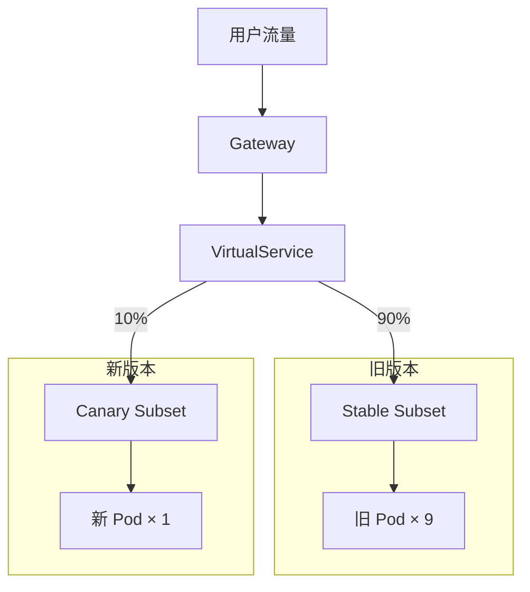
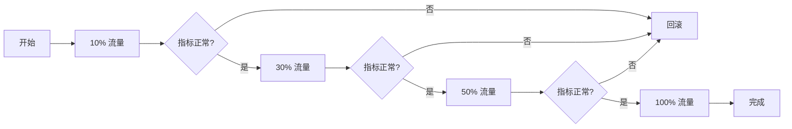

# Canary 发布

**Canary（灰度发布）** 是 DevFlow 最推荐的发布方式。它的核心思想是：**先让一小部分用户试用新版本，验证没问题后再扩大范围**。

就像餐厅推出新菜品，先给 VIP 客人试吃，反馈好再全员推广。

---

## 适合什么场景

- 核心 API、支付系统
- 用户量大的前端服务
- 任何需要风险控制的服务

---

## 原理


```mermaid
graph TB
    User["用户流量"]
    GW["Gateway"]
    VS["VirtualService"]

    subgraph "旧版本"
        Stable["Stable Subset"]
        OldPod["旧 Pod × 9"]
    end

    subgraph "新版本"
        Canary["Canary Subset"]
        NewPod["新 Pod × 1"]
    end

    User --> GW --> VS
    VS -->|90%| Stable --> OldPod
    VS -->|10%| Canary --> NewPod
```

Istio 通过 VirtualService 的权重控制流量分配。Argo Rollouts 管理新版本的 ReplicaSet，逐步调整权重。

---

## 灰度节奏

默认的灰度节奏是四阶段：

| 阶段 | 流量 | 持续时间 | 做什么 |
|------|------|---------|--------|
| 1 | 10% | 5 分钟 | 观察错误率和延迟 |
| 2 | 30% | 10 分钟 | 观察吞吐量和资源使用 |
| 3 | 50% | 10 分钟 | 观察业务指标 |
| 4 | 100% | — | 全量切换完成 |

每个阶段结束后，系统会自动检查 Prometheus 指标。如果错误率飙升或延迟异常，自动回滚到上一个阶段。

---

## 发布过程


```mermaid
graph LR
    A["开始"] --> B["10% 流量"]
    B --> C{"指标正常?"}
    C -->|否| R["回滚"]
    C -->|是| D["30% 流量"]
    D --> E{"指标正常?"}
    E -->|否| R
    E -->|是| F["50% 流量"]
    F --> G{"指标正常?"}
    G -->|否| R
    G -->|是| H["100% 流量"]
    H --> I["完成"]
```

---

## 回滚

Canary 的回滚极快：

```
出问题 → VirtualService 权重切回 100% 旧版本 → 秒级完成
```

流量切换是瞬时的，不受 Pod 启停速度影响。

---

## 优缺点

| ✅ 优点 | ❌ 缺点 |
|---------|---------|
| 风险可控，只影响少量用户 | 需要 Istio + Argo Rollouts |
| 回滚极快（秒级） | 资源占用中等 |
| 基于真实流量验证 | 灰度阶段需要持续观察 |
| 支持自动指标检查 | |

---

## 一句话总结

Canary 就是"先试水再深潜" — 风险最小、最安全的发布方式，适合大多数核心服务。
