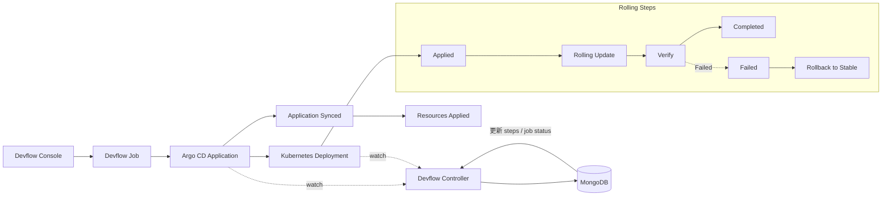

# 🟢 Normal（Rolling）发布实战：Argo CD + Kubernetes Deployment

Normal（Rolling）发布基于 **Kubernetes Deployment** 的滚动更新能力（RollingUpdate），适合大多数普通业务场景。

---

## 🗺️ 1. Devflow Normal（Rolling）发布流程图（示例）

说明：

- 发布链路：Devflow Console 触发 Job，生成 Argo CD Application，下发 Deployment。
- 控制闭环：Devflow Controller 监听 Application 与 Deployment 状态，回写 Mongo 的 `steps` 与 `job status`。
- Normal 节奏：Rolling Update 完成后进入 Completed。

---

## 🧭 2. 端到端步骤（Devflow 驱动）

1. **Devflow 创建 Application 成功**  
   - Devflow Job 创建 Argo CD Application  
   - Application 进入 `Synced`（不一定 `Healthy`）

2. **Argo CD 同步并创建/更新资源成功**  
   - Argo CD 监听到 Application 变更  
   - 生成/更新 Deployment、Service 等资源  

3. **Deployment 开始滚动更新**  
   - Devflow Controller 监听 Deployment 状态  
   - 持续更新 `steps` 与 `job status`：
     - Rolling Update → Verify（成功）
     - Completed
   - 若新版本 Pod 启动失败（如 NotReady / CrashLoopBackOff），对应 Verify 进入 `Failed` 并触发回滚

> 若 Verify 失败，Controller 标记对应阶段失败并触发回滚流程（按策略自动或人工介入）。

---

## 📋 3. Normal（Rolling）Steps / Status 对照表

| Step | 状态（Status） | 触发事件 / 说明 |
|------|----------------|----------------|
| Applied | Running → Succeeded/Failed | Application 创建并 Sync 成功 |
| Rolling Update | Running → Succeeded | Deployment 滚动更新进行中 |
| Verify | Running → Succeeded / Failed | 指标通过或 Pod 启动正常 / Pod NotReady 或 CrashLoopBackOff |
| Completed | Succeeded | 发布完成 |
| Failed | Failed | Verify 失败触发回滚 |
| Rollback to Stable | Succeeded | 回滚至稳定版本 |

---

## ✅ 4. 适用场景

- 普通业务系统
- 对精细化流量控制要求不高
- 资源成本敏感且发布频率较高
