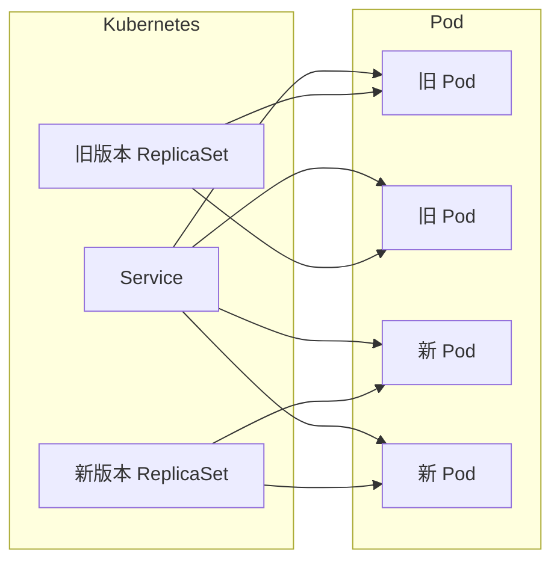

# Rolling 发布

**Rolling（滚动更新）** 是最简单的发布方式。Kubernetes 逐步创建新版本 Pod，同时销毁旧版本 Pod，就像换轮胎时一个一个换，车一直在跑。

---

## 适合什么场景

- 内部工具、后台管理系统
- 资源敏感、成本优先的服务
- 对短暂波动容忍度较高的应用

---

## 原理


```mermaid
graph LR
    subgraph "Kubernetes"
        RS1["旧版本 ReplicaSet"]
        RS2["新版本 ReplicaSet"]
        Svc["Service"]
    end
    subgraph "Pod"
        P1["旧 Pod"]
        P2["旧 Pod"]
        P3["新 Pod"]
        P4["新 Pod"]
    end

    Svc --> P1
    Svc --> P2
    Svc --> P3
    Svc --> P4
    RS1 --> P1
    RS1 --> P2
    RS2 --> P3
    RS2 --> P4
```

Service 同时指向新旧 Pod，流量自然平滑过渡。K8s 控制每次最多多创建 25% 的新 Pod，最多只允许 25% 的 Pod 不可用。

---

## 发布过程

```
开始: [旧][旧][旧]           (3 Pod)
      ↓
步骤 1: [旧][旧][旧][新]       (创建 1 个新 Pod)
      ↓
步骤 2: [旧][旧][新][新]       (销毁 1 个旧 Pod)
      ↓
步骤 3: [旧][新][新][新]       (继续替换)
      ↓
完成: [新][新][新]           (全部替换完毕)
```

---

## 回滚

Rolling 的回滚是反向的滚动更新：

```
当前: [新][新][新]
      ↓
回滚: [新][新][旧]
      ↓
完成: [旧][旧][旧]
```

**回滚时间**：1-5 分钟（取决于副本数和替换速度）。

---

## 优缺点

| ✅ 优点 | ❌ 缺点 |
|---------|---------|
| 资源占用最低 | 回滚速度慢 |
| 无需额外组件 | 出问题影响所有用户 |
| 实现最简单 | 无法控制流量比例 |

---

## 一句话总结

Rolling 就是"稳扎稳打" — 成本低、实现简单，适合不那么关键的服务。
