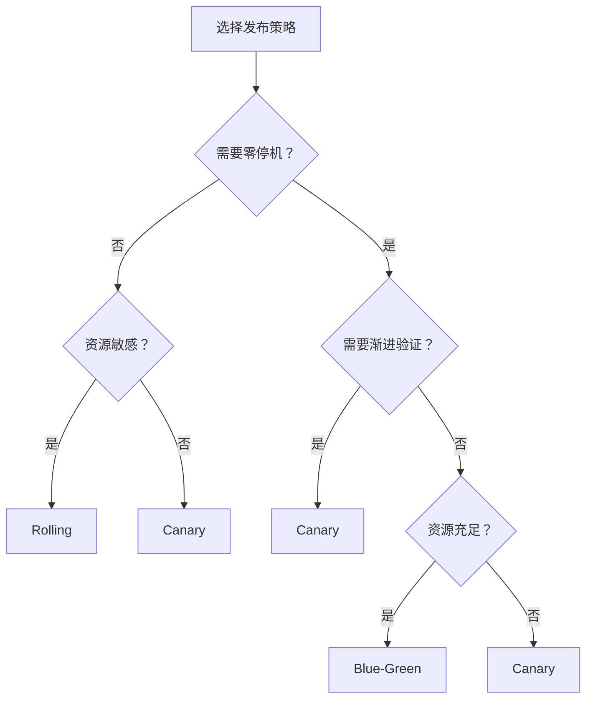

# 发布策略选型

选对发布策略，既能保证安全，又不浪费资源。这一页帮你做决定。

> 选策略就像选交通工具：
> - Rolling 是公交车——便宜、稳定，但慢
> - Canary 是网约车——灵活、可控，根据路况调整
> - Blue-Green 是双轨地铁——新旧并行，瞬时切换

---

## 三种策略对比

| 维度 | Rolling | Canary | Blue-Green |
|------|---------|--------|------------|
| 核心思想 | 逐步替换 Pod | 渐进式切流量 | 两套实例并行切换 |
| 资源占用 | 低（最多 125%） | 中（最多 200%） | 高（200%） |
| 回滚速度 | 慢（1-5 分钟） | 快（秒级） | 最快（瞬时） |
| 故障影响 | 全量用户 | 灰度用户 | 可控制在 Preview |
| 需要组件 | K8s 原生 | Istio + Argo Rollouts | Argo Rollouts |
| 运维复杂度 | 低 | 中 | 中 |

---

## 选型决策树


```mermaid
graph TD
    A["选择发布策略"] --> B{"需要零停机？"}
    B -->|否| C{"资源敏感？"}
    C -->|是| D["Rolling"]
    C -->|否| E["Canary"]
    B -->|是| F{"需要渐进验证？"}
    F -->|是| G["Canary"]
    F -->|否| H{"资源充足？"}
    H -->|是| I["Blue-Green"]
    H -->|否| J["Canary"]
```

---

## 场景化建议

| 场景 | 推荐 | 理由 |
|------|------|------|
| 内部工具、后台管理 | Rolling | 资源敏感，对停机容忍度高 |
| 普通 API 服务 | Rolling / Canary | 根据风险敏感度选 |
| 核心支付 API | Canary | 需要渐进验证，控制风险 |
| 用户量大的前端 | Canary | 需要真实流量验证 |
| 金融核心交易 | Blue-Green | 必须零停机 |
| 数据库 Schema 变更 | Blue-Green | 新旧版本共存验证 |
| 大版本升级 | Canary（长周期）| 长周期观察稳定性 |
| 热修复 / 紧急补丁 | Blue-Green | 最快回滚，最低风险 |

---

## 真实场景故事

### 场景一：小明的内部工具

小明负责一个内部数据分析工具，只有 20 个同事在用。他选 Rolling 发布：

> "反正就 20 个人，出问题了我在群里喊一声就行。Rolling 最省资源，我不需要额外装 Istio。"

**结果**：发布花了 3 分钟，CPU 占用从 30% 涨到 40%，完全没问题。

### 场景二：小红的核心支付服务

小红负责支付网关，每秒处理 1000 笔交易。她选 Canary 发布：

> "支付不能出问题，但也不能停服。Canary 让我先给 10% 的流量用新版本，观察 5 分钟。错误率正常？好，扩大到 30%。"

**结果**：发布花了 20 分钟，但零故障。中间有一次延迟 spike，系统自动暂停了扩量，小红排查后发现是数据库连接池配置问题，修复后继续发布。

### 场景三：老王的金融核心系统

老王负责银行核心账务系统，必须 7×24 运行。他选 Blue-Green 发布：

> "我们这个系统停机 1 分钟就是几百万的损失。Blue-Green 让我先部署一套完整的新版本，在 Preview 环境里跑真实的对账验证。验证通过了，一键切换，用户完全无感知。"

**结果**：发布切换用了 0.5 秒，业务零中断。旧版本保留在 Preview 里 24 小时，确认没问题再删除。

---

## 详细说明

### Rolling — 一步一步换

K8s 逐步创建新版本 Pod，同时销毁旧版本 Pod：

```
[旧][旧][旧] → [旧][旧][旧][新] → [旧][旧][新][新] → [新][新][新]
```

适合大多数无状态应用。简单、省资源，但回滚慢。

### Canary — 先让少数人试

通过 Istio 权重控制流量切换：

```
阶段 1: 旧 90% ← 新 10%
阶段 2: 旧 70% ← 新 30%
阶段 3: 旧 50% ← 新 50%
阶段 4: 旧 0%  ← 新 100%
```

每个阶段自动检查指标（错误率、延迟），不达标就回滚。适合核心服务。

### Blue-Green — 走天桥

两套实例并行：

```
部署前: Active → Blue(旧)   Preview → 空
部署中: Active → Blue(旧)   Preview → Green(新)
切换后: Active → Green(新)  Preview → Blue(旧)
```

验证通过后一键切换，瞬时完成。适合关键业务。
