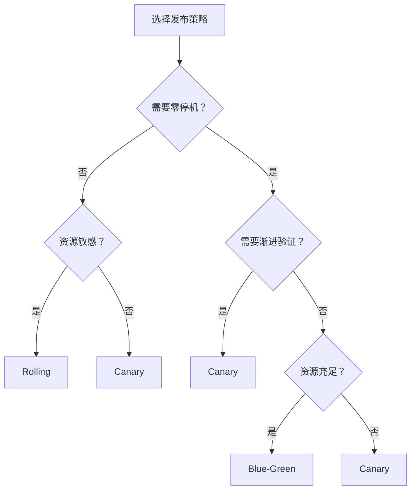

# 发布策略选型

选对发布策略，既能保证安全，又不浪费资源。这一页帮你做决定。

---

## 三种策略对比

| 维度 | Rolling | Canary | Blue-Green |
|------|---------|--------|------------|
| 核心思想 | 逐步替换 Pod | 渐进式切流量 | 两套实例并行切换 |
| 资源占用 | 低（最多 125%） | 中（最多 200%） | 高（200%） |
| 回滚速度 | 慢（1-5 分钟） | 快（秒级） | 最快（瞬时） |
| 故障影响 | 全量用户 | 灰度用户 | 可控制在 Preview |
| 需要组件 | K8s 原生 | Istio + Argo Rollouts | Argo Rollouts |
| 运维复杂度 | 低 | 中 | 中 |

---

## 选型决策树


```mermaid
graph TD
    A["选择发布策略"] --> B{"需要零停机？"}
    B -->|否| C{"资源敏感？"}
    C -->|是| D["Rolling"]
    C -->|否| E["Canary"]
    B -->|是| F{"需要渐进验证？"}
    F -->|是| G["Canary"]
    F -->|否| H{"资源充足？"}
    H -->|是| I["Blue-Green"]
    H -->|否| J["Canary"]
```

---

## 场景化建议

| 场景 | 推荐 | 理由 |
|------|------|------|
| 内部工具、后台管理 | Rolling | 资源敏感，对停机容忍度高 |
| 普通 API 服务 | Rolling / Canary | 根据风险敏感度选 |
| 核心支付 API | Canary | 需要渐进验证，控制风险 |
| 用户量大的前端 | Canary | 需要真实流量验证 |
| 金融核心交易 | Blue-Green | 必须零停机 |
| 数据库 Schema 变更 | Blue-Green | 新旧版本共存验证 |
| 大版本升级 | Canary（长周期）| 长周期观察稳定性 |
| 热修复 / 紧急补丁 | Blue-Green | 最快回滚，最低风险 |

---

## 详细说明

### Rolling — 一步一步换

K8s 逐步创建新版本 Pod，同时销毁旧版本 Pod：

```
[旧][旧][旧] → [旧][旧][旧][新] → [旧][旧][新][新] → [新][新][新]
```

适合大多数无状态应用。简单、省资源，但回滚慢。

### Canary — 先让少数人试

通过 Istio 权重控制流量切换：

```
阶段 1: 旧 90% ← 新 10%
阶段 2: 旧 70% ← 新 30%
阶段 3: 旧 50% ← 新 50%
阶段 4: 旧 0%  ← 新 100%
```

每个阶段自动检查指标（错误率、延迟），不达标就回滚。适合核心服务。

### Blue-Green — 走天桥

两套实例并行：

```
部署前: Active → Blue(旧)   Preview → 空
部署中: Active → Blue(旧)   Preview → Green(新)
切换后: Active → Green(新)  Preview → Blue(旧)
```

验证通过后一键切换，瞬时完成。适合关键业务。
