## 🧭 速览

- Canary：渐进放量，适合核心业务  
- Blue/Green：原子切流，回滚快  
- Rolling：默认策略，成本低  

## 🧭 发布策略选型建议

| 场景 | 推荐策略 |
|----|----|
| 内部系统 | Recreate / Rolling |
| 普通业务 | Rolling |
| 核心生产系统 | Canary |
| 高回滚要求 | Blue / Green |
| 功能实验 | A/B |
| 新系统验证 | Shadow |

---

## 🧰 云原生 CD 最佳实践

- 构建与发布完全解耦
- 发布过程必须可回滚
- 基于指标和 SLO 驱动发布决策
- 发布过程全链路可观测（Metric / Trace / Log）
- 所有发布行为可审计、可追溯

## ⚖️ Canary 与 Blue/Green 发布方案对比

### 1. 概述

Canary（灰度发布）与 Blue/Green（蓝绿发布）是云原生场景中最常见的两种发布策略。
二者都用于降低发布风险，但在**流量控制方式、资源模型、回滚机制**等方面存在本质差异。

---

### 2. 核心思想对比

| 维度 | Canary（灰度发布） | Blue/Green（蓝绿发布） |
|----|------------------|-----------------------|
| 核心思想 | 小流量逐步验证新版本 | 两套完整环境原子切换 |
| 发布风险 | 渐进降低 | 切换瞬间承担 |
| 流量模型 | 按比例分流 | 全量切换 |
| 验证方式 | 实时观测生产流量 | 预览 + 切流后验证 |

---

### 3. 流量控制方式

#### Canary

- 同时运行新旧版本
- 流量按比例逐步切换：
  - 10% → 30% → 50% → 100%
- 依赖能力：
  - Argo Rollouts 自身权重
  - Istio / NGINX / ALB 等流量网关

#### Blue/Green

- 通过 Service selector 实现切换
- 切流是 **一次性原子操作**
- 不支持按比例分流
- Preview 流量与正式流量严格隔离

---

### 4. 资源使用对比

| 维度 | Canary | Blue/Green |
|----|------|-----------|
| 发布期间副本 | 新旧版本同时存在 | 新旧版本完整运行 |
| 峰值资源消耗 | 较低 | 较高（接近 2x） |
| 资源弹性要求 | 中 | 高 |

---

### 5. 回滚机制对比

#### Canary 回滚

- 逐步将流量权重降为 0
- 旧版本始终在线
- 回滚速度取决于流量调度系统

#### Blue/Green 回滚

- 直接切换 Service selector
- 回滚几乎是瞬时完成
- 不依赖流量权重计算

---

### 6. 发布控制能力

| 能力 | Canary | Blue/Green |
|----|------|-----------|
| 手动暂停 | 支持 | 支持 |
| 自动推进 | 支持 | 支持 |
| 指标驱动发布 | 强 | 中 |
| 精细流量控制 | 强 | 无 |

---

### 7. Analysis（分析）能力

#### Canary

- 每个阶段可配置 Analysis
- 支持：
  - 错误率
  - 延迟
  - 业务指标
- 失败可自动回滚

#### Blue/Green

- 支持 Pre-Promotion Analysis
- 支持 Post-Promotion Analysis
- 更偏向“发布前 / 发布后”校验

---

### 8. 故障影响范围

| 维度 | Canary | Blue/Green |
|----|------|-----------|
| 故障暴露用户 | 小范围 | 全量 |
| 故障发现速度 | 快 | 取决于监控 |
| 用户影响控制 | 强 | 弱 |

---

### 9. 运维复杂度

| 维度 | Canary | Blue/Green |
|----|------|-----------|
| 配置复杂度 | 高 | 低 |
| 流量系统依赖 | 强 | 弱 |
| 运维心智负担 | 高 | 低 |

---

### 10. 适用场景对比

#### 适合 Canary 的场景

- 高并发互联网业务
- 需要真实流量验证
- 业务指标敏感
- 允许逐步放量

#### 适合 Blue/Green 的场景

- 核心系统 / 金融系统
- 回滚时间要求极高
- 不允许流量混跑
- 发布频率相对较低

---

### 11. 总结对比

| 维度 | 推荐方案 |
|----|--------|
| 极致稳定 & 秒级回滚 | Blue/Green |
| 风险最小化 & 渐进验证 | Canary |
| 资源充足 | Blue/Green |
| 资源受限 | Canary |

---

### 12. 选型建议

- **核心链路**：Blue/Green
- **用户入口服务**：Canary
- **微服务体系**：Canary + 自动 Analysis
- **基础平台组件**：Blue/Green

---

### 13. 一句话总结

> Canary 是“**边跑边试**”，  
> Blue/Green 是“**切换开关**”。

---

## 🗺️ Devflow Normal（Rolling）发布流程图（示例）

```mermaid
flowchart LR
    A[Devflow Console] --> B[Devflow Job]
    B --> C[Argo CD Application]
    C --> D[Kubernetes Deployment]

    C -. watch .-> F[Devflow Controller]
    D -. watch .-> F
    F --> M[(MongoDB)]
    M -->|更新 steps / job status| F

    D --> S0
    subgraph Rolling Steps
        S0[Applied] --> S1[Rolling Update]
        S1 --> S2[Verify]
        S2 --> S3[Completed]
    end
```

说明：

- 发布链路：Devflow Console 触发 Job，生成 Argo CD Application，下发到 Kubernetes Deployment。
- 控制闭环：Devflow Controller 监听 Application 与 Deployment 状态，回写 Mongo 的 `steps` 与 `job status`。
- Normal 节奏：Deployment 完成 Rolling Update 后进入 Completed。
