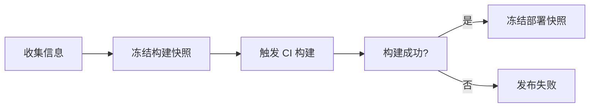
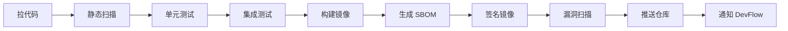

# 🧪 持续集成（CI）

🏗️ Build 🔐 Supply Chain 📦 OCI Registry

DevFlow 的 CI 基于 **Tekton Pipeline**。当你发起一次发布时，release-service 会自动触发构建流水线，把代码变成可信的容器镜像。

---

## 📍 CI 在发布流程中的位置

CI 是发布流程的第 3 步。只有构建成功，才会继续创建 Release 并部署。

---

## 🏭 标准 CI 流程

一次完整的构建要走 10 个步骤：

### 1. 拉代码
从 Git 仓库拉取指定版本的代码，验证 commit hash 和 Manifest 中记录的是否一致。

### 2. 静态扫描
检查代码中有没有硬编码的密码、密钥，有没有已知漏洞的依赖版本。

### 3. 单元测试
跑项目的单元测试。覆盖率低于 60% 或测试失败，构建直接终止。

### 4. 集成测试
在隔离环境里启动依赖服务，跑端到端测试。

### 5. 构建镜像
用 Buildah 构建容器镜像。支持多阶段构建，最终镜像尽量小。

### 6. 生成 SBOM
生成软件物料清单，记录镜像里装了什么组件、什么版本。用于后续的漏洞追踪和合规审计。

### 7. 签名镜像
用 Cosign 给镜像签名，确保镜像来源可信，防止被篡改。

### 8. 漏洞扫描
用 Trivy 扫描镜像中的已知漏洞。发现 CRITICAL 漏洞，构建直接终止。

### 9. 推送仓库
把镜像、SBOM、签名一起推送到 OCI Registry。

### 10. 通知 DevFlow
构建完成后，回调 release-service。成功就继续创建 Release，失败就标记发布失败。

---

## 🚨 质量门禁

| 🔍 检查项 | ⛔ 失败后果 |
|--------|---------|
| 静态扫描发现敏感信息 | 构建终止 |
| 单元测试失败或覆盖率不足 | 构建终止 |
| 集成测试失败 | 构建终止 |
| 漏洞扫描发现 CRITICAL 漏洞 | 构建终止 |

**核心理念**：有问题的代码不应该被打包成镜像。

---

## 🧭 文档导航

| 📄 文档 | 📝 内容 |
|------|------|
| [CI 架构](architecture/) | Tekton 怎么和 DevFlow 配合 |
| [标准流程](standard/) | 每个步骤的详细说明 |
| [组件矩阵](component/) | CI 用到的所有工具 |
| [队列与并发](queue/) | 高并发构建时的资源控制 |
