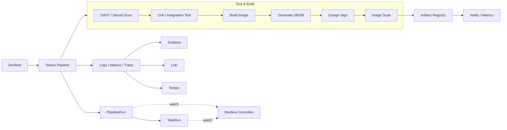

# 🏗️ CI 架构图（Architecture）

下面是 CI 核心链路与平台依赖的整体关系图。

## 🗺️ Mermaid 版

## ✅ 关键说明

- **触发**：Devflow Console / Job 触发 Pipeline 执行
- **监听**：Devflow Controller 同时监听 PipelineRun 与 TaskRun 状态
- **安全**：SAST / SBOM / 签名 / 扫描构成供应链安全闭环
- **制品**：镜像推送到 Registry，支持 digest 可追溯
- **反馈**：构建结果通过通知 + 观测系统快速反馈
