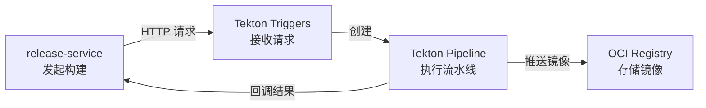

# 🧪 CI 架构

DevFlow 的 CI 基于 **Tekton**，一个云原生的 CI/CD 框架。当你发起发布时，release-service 触发 Tekton Pipeline，自动完成从代码到镜像的转换。

它最大的优势是：**发布步骤不是写死在业务代码里的，而是由 Pipeline Task 组合出来的。**

这意味着 operator 可以通过新增、调整或重排 task 来改变发布步骤，而不需要改 release-service 的核心逻辑。

---

## 🧭 流水线怎么跑


```mermaid
graph LR
    Release["release-service<br/>发起构建"]
    Trigger["Tekton Triggers<br/>接收请求"]
    Pipeline["Tekton Pipeline<br/>执行流水线"]
    Registry["OCI Registry<br/>存储镜像"]

    Release -->|HTTP 请求| Trigger
    Trigger -->|创建| Pipeline
    Pipeline -->|推送镜像| Registry
    Pipeline -->|回调结果| Release
```

1. release-service 发一个 HTTP 请求给 Tekton Triggers
2. Tekton 创建一个 PipelineRun，开始跑流水线
3. 流水线跑完后，把镜像推送到仓库，再回调通知 release-service

### 这套设计为什么强

- 新步骤可以通过新增 task 注入
- 现有步骤可以通过调整 task 顺序或参数扩展
- 回滚、暂停、审批、观测这类变体也可以做成 pipeline 级能力
- release-service 只负责状态机和契约，不需要把每一种步骤变化硬编码进去

前提是 task 的输入输出契约必须稳定，否则流水线会变成不可维护的“脚本堆”。

---

## 流水线里的 7 个任务

一次标准构建要跑 7 个任务，串行执行：

```
拉代码 → 扫漏洞 → 跑测试 → 构建镜像 → 生成清单 → 签名 → 再扫一遍
```

| 任务 | 做什么 | 失败了会怎样 |
|------|--------|------------|
| 源码获取 | 从 Git 拉代码 | 构建终止 |
| 静态扫描 | 检查敏感信息和依赖漏洞 | 构建终止 |
| 测试 | 跑单元测试和集成测试 | 构建终止 |
| 镜像构建 | 用 Buildah 构建容器镜像 | 构建终止 |
| SBOM 生成 | 记录镜像里有什么组件 | 继续（警告）|
| 镜像签名 | 用 Cosign 给镜像签名 | 继续（警告）|
| 漏洞扫描 | 用 Trivy 扫最终镜像 | 发现严重漏洞则终止 |

---

## 🧰 关键工具

### Tekton Pipelines — 流水线引擎

定义和执行 CI 流水线的框架。Pipeline 由多个 Task 组成，Task 之间通过共享目录传递数据（比如源码、构建产物）。

### Buildah — 镜像构建工具

不需要 Docker Daemon，直接在容器里构建镜像。支持 rootless，更安全。

### Cosign — 镜像签名工具

给镜像做数字签名，确保镜像在传输和存储过程中没被篡改。验证时通过公钥确认镜像来源可信。

### Trivy — 漏洞扫描工具

扫描镜像里的已知漏洞，包括操作系统包、语言依赖、配置文件问题。

---

## 🔌 release-service 和 Tekton 怎么交互

**发起构建时**，release-service 告诉 Tekton：
- 应用 ID、Manifest ID
- Git 仓库地址和版本
- 构建参数

**构建完成后**，Tekton 告诉 release-service：
- 成功/失败
- 镜像 digest
- SBOM 和签名信息
- 漏洞扫描结果

双方通过 HTTP 回调交互，release-service 不需要轮询等待。
