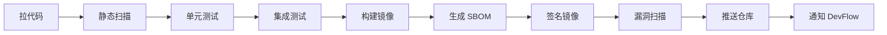

# 标准 CI 流程

DevFlow 的标准 CI 流水线确保每个镜像在发布前都经过完整的安全和质量检查。

---

## 流程概览

---

## 各阶段说明

### 1. 拉代码

从 Git 仓库拉取指定版本的代码，验证 commit hash 与 Manifest 中记录的是否一致。

如果不一致，说明代码在发起发布后被人修改过，构建终止。

### 2. 静态扫描

扫描代码中的安全问题：

- **敏感信息泄露** — 有没有硬编码的密码、Token、密钥
- **依赖漏洞** — 引用的第三方库有没有已知漏洞
- **代码规范** — 是否符合团队编码规范

### 3. 单元测试

执行项目的单元测试。

**门禁**：覆盖率 ≥ 60%，且所有测试必须通过。

### 4. 集成测试

在隔离环境中启动依赖服务（数据库、缓存等），执行端到端测试。

验证应用在实际依赖存在时是否能正常工作。

### 5. 构建镜像

使用 Buildah 构建容器镜像。

**最佳实践**：
- 使用最小化基础镜像（distroless / alpine）
- 多阶段构建，减少最终镜像体积
- 非 root 用户运行容器

### 6. 生成 SBOM

生成软件物料清单（Software Bill of Materials），记录镜像中的所有组件和依赖版本。

格式：SPDX 或 CycloneDX

用途：漏洞追踪、合规审计、供应链安全。

### 7. 签名镜像

使用 Cosign 对镜像进行数字签名，确保镜像在传输和存储过程中没有被篡改。

签名密钥存储在 Kubernetes Secret 中，通过 RBAC 控制访问。

### 8. 漏洞扫描

使用 Trivy 扫描镜像中的已知漏洞。

| 漏洞等级 | 处理方式 |
|---------|---------|
| CRITICAL | 必须修复，否则构建终止 |
| HIGH | 24 小时内修复 |
| MEDIUM / LOW | 记录并跟踪 |

### 9. 推送仓库

将镜像、SBOM 和签名推送到 OCI Registry（Zot）。

### 10. 通知 DevFlow

构建完成后，Tekton 通过 HTTP 回调通知 release-service：

- **成功** — 继续创建 Release，进入部署流程
- **失败** — 更新 Manifest 状态为 Failed，发布终止

---

## 质量门禁总结

| 阶段 | 门禁条件 | 失败后果 |
|------|---------|---------|
| 静态扫描 | 无敏感信息泄露 | 构建终止 |
| 单元测试 | 覆盖率 ≥ 60%，全部通过 | 构建终止 |
| 集成测试 | 全部通过 | 构建终止 |
| 漏洞扫描 | 无 CRITICAL 漏洞 | 构建终止 |

有问题的代码不会被打包成镜像，也不会进入部署环节。
