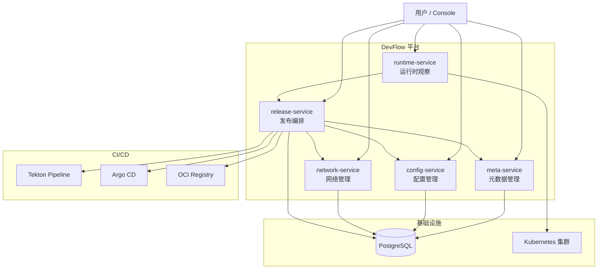

# 🏗️ 架构设计

DevFlow 由 **5 个独立服务**组成，每个服务负责一个明确的领域。它们各自独立部署、独立扩展，通过标准接口协作。

---

## 🗺️ 整体架构图

---

## 🤝 五个服务怎么协作

想象一次完整的发布流程，五个服务是这样配合的：

### 第一步：📚 查资料（meta-service）

release-service 想发布一个应用，首先问 meta-service：

> "这个应用叫什么？代码仓库在哪？要发到哪个环境？那个环境在哪个集群？"

meta-service 是**所有元数据的权威来源**。其他服务想要应用、环境、集群的信息，都来找它。

### 第二步：🧪 查配置（config-service + network-service）

release-service 接着问 config-service 和 network-service：

> "这个应用的基础配置是什么？目标环境的特殊配置是什么？网络怎么配的？"

config-service 管**运行时配置**（副本数、资源、环境变量），network-service 管**网络定义**（Service、Route）。

### 第三步：🧊 冻结快照（release-service）

release-service 把收集到的所有信息打包成两份快照：

- **Manifest** — 构建前冻结（代码版本、基础配置、网络拓扑）
- **Release** — 部署前冻结（Manifest + 环境配置 + 发布策略）

这两份快照一旦创建就**不能再改**，确保发布可重现。

### 第四步：🚀 构建 + 部署（release-service → Tekton → Argo CD）

release-service 触发 Tekton 构建镜像，然后把渲染好的 Kubernetes 配置推送到  OCI Registry，最后通知 Argo CD 部署到集群。

### 第五步：👀 观察状态（runtime-service）

runtime-service 盯着 Kubernetes 集群，实时看 Pod 的状态变化，然后把进度回写给 release-service。

用户打开 Console，就能看到发布进行到哪一步了。

---

## 📐 关键设计原则

### 1. ✂️ 每个服务有明确的边界

| ⚙️ 服务 | ✅ 负责什么 | ⛔ 不碰什么 |
|------|---------|---------|
| meta-service | 应用、环境、集群的元数据 | 配置、网络、发布逻辑 |
| config-service | WorkloadConfig、AppConfig | 元数据、网络、发布 |
| network-service | Service、Route | 元数据、配置、发布 |
| release-service | 发布全流程编排 | 运行时直接操作 |
| runtime-service | 运行时观察 + 运维操作 | 发布编排、元数据 |

### 2. 📸 发布用快照，不用实时配置

DevFlow 不会直接把数据库里的配置发到 Kubernetes。而是：

1. 发布那一刻，把所有配置**快照**下来
2. 快照打包成不可变的 Bundle
3. Bundle 通过 GitOps 部署

好处是：**回滚时，你回滚到的是一份完整的、当时的配置，不是数据库里可能已经改过的配置**。

### 3. 🧠 runtime-service 不碰数据库

runtime-service 是唯一个**不用 PostgreSQL** 的服务。它直接从 Kubernetes API 读状态，存在内存里。

为什么？因为 Kubernetes 的状态变化太快了，写数据库会拖慢查询。内存索引可以毫秒级响应，适合 Console 的实时刷新。
