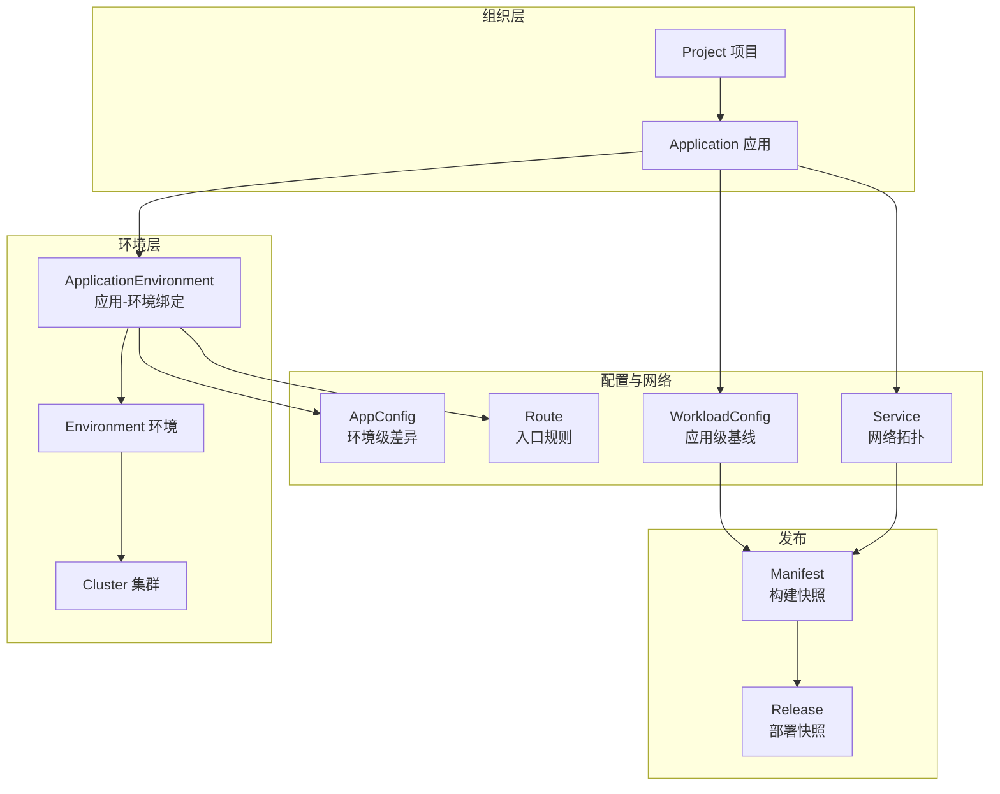
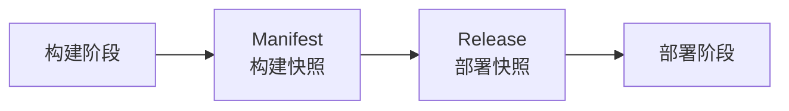

# 领域模型

DevFlow 中的资源模型分为四个层级，从组织到部署，层层递进。

---

## 资源关系总览



---

## 四个层级

### 第一层：组织

**Project** 和 **Application** 负责"谁拥有什么"。

```
Project: 电商中台
  └─ Application: order-service
  └─ Application: payment-service
```

### 第二层：环境

**Environment** 和 **Cluster** 负责"在哪跑"。

```
Cluster: prod-cluster
  └─ Environment: production (namespace: order-prod)
  └─ Environment: staging (namespace: order-staging)
```

**ApplicationEnvironment** 是应用和环境的"绑定关系"，它承载了环境专属的配置：

```
order-service + production = order-service-prod
  └─ AppConfig: DB_HOST=prod-db...
  └─ Route: host=order.example.com...
```

### 第三层：配置与网络

这一层回答"怎么跑"和"怎么访问"。

| 资源 | 属于 | 用途 | 随环境变化 |
|------|------|------|-----------|
| **WorkloadConfig** | Application | 副本数、资源、探针 | 否 |
| **AppConfig** | ApplicationEnvironment | 数据库地址、日志级别 | 是 |
| **Service** | Application | 暴露哪些端口 | 否 |
| **Route** | ApplicationEnvironment | 域名、证书 | 是 |

**设计意图**：基线配置（WorkloadConfig、Service）和应用绑定，不随环境变化；环境差异（AppConfig、Route）和绑定关系绑定，随环境变化。

### 第四层：发布

**Manifest** 和 **Release** 是发布过程中的两份不可变快照。

| 快照 | 什么时候创建 | 包含什么 | 能否复用 |
|------|------------|---------|---------|
| **Manifest** | 构建前 | 代码版本、镜像、基础配置、网络拓扑 | 能（跨环境） |
| **Release** | 部署前 | Manifest + 环境配置 + 发布策略 | 不能（绑定环境） |

---

## 冻结点设计

DevFlow 最核心的设计是**发布前冻结两份快照**：



**Manifest 不承载**：目标环境、环境配置、环境路由。这使得同一个 Manifest 可以发到测试、生产任何环境。

**Release 不承载**：上游元数据（由 meta-service 管理）、WorkloadConfig 基线（由 Manifest 承载）。Release 只关注"这次部署的完整上下文"。

**好处**：
- 同一个版本可以发多个环境
- 回滚时精确恢复到当时的完整状态
- 发布历史可追溯、可审计
