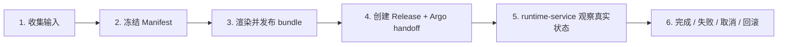

# 🧭 发布生命周期

🧩 release-service  Tekton 📦 OCI Registry  Argo CD 👀 runtime-service

DevFlow 的发布，本质上是一条“冻结事实 -> 渲染部署 -> 交给集群执行 -> 观察结果 -> 收尾或回滚”的流水线。
它不是一串临时操作，而是一套可追踪、可取消、可回滚的生命周期。

这篇文档按原理来讲：先看整条链路怎么分层，再看每一层失败、取消和回滚该怎么处理。

---

## 一句话理解

一次发布会经历 6 个大层：

1. 收集并冻结输入
2. 构建并冻结镜像侧事实
3. 渲染并发布部署包
4. 创建部署对象并交给 Argo CD
5. 由 `runtime-service` 观察集群真实状态
6. 根据结果完成、失败、取消或回滚

核心原则只有三个：

- **快照不可变**: `Manifest` 和 `Release` 都是冻结点，创建后不应随意改写
- **责任分离**: `release-service` 负责发布事实，`runtime-service` 负责观察事实，Argo CD 负责集群执行
- **结果优先于意图**: 取消只是一个意图，真正的结果要看当前阶段是否已经进入不可逆动作

---

## 整体结构

这条链路里，越往后越接近真实集群状态，也越不适合“直接撤销”。

---

## 1. 收集输入

这一层做的是“把发布所需的事实收齐”。

输入通常来自：

- `meta-service`：应用、环境、集群
- `config-service`：工作负载配置、应用配置
- `network-service`：Service、Route

这一层本身不应该产出可执行的发布结果，它只负责把后面冻结要用的事实准备好。

### 失败怎么处理

- 元数据缺失: 直接失败，不进入后续阶段
- 配置不一致: 返回错误，让用户先修复配置
- 目标环境不存在: 停止本次发布

### 取消怎么处理

- 这一层最容易取消
- 取消后只需要停止继续收集，不创建快照
- 取消不应留下半成品部署对象

### 回滚怎么处理

- 这一层通常不需要回滚
- 因为还没有进入不可逆的集群动作

---

## 2. 冻结 Manifest

`Manifest` 是 build-side freeze point。
它记录“这次构建到底基于什么事实”。

冻结内容通常包括：

- 代码版本
- workload 基线
- service 基线
- build 触发信息

`Manifest` 一旦创建，就应视为不可变。

### 失败怎么处理

- 构建失败: 保留 `Manifest`，不创建后续 `Release`
- 依赖构建失败: 标记本次构建失败，保留诊断信息
- 镜像产物不存在: 仍然停在 Manifest 层

### 取消怎么处理

- 如果取消发生在 Manifest 之后、Release 之前，保留 Manifest
- 不要删除 Manifest，因为它是可追踪证据
- 不要伪装成成功

### 回滚怎么处理

- 这一层通常不做回滚
- 只需要在下一次发布时选用旧 Manifest

---

## 3. 渲染并发布 bundle

这一层把冻结后的事实叠加成“可部署内容”。

可以理解为：

`Manifest` + `Release` 的环境输入 + 发布策略 = 最终部署 bundle

然后 bundle 会被发布到 OCI。

### 失败怎么处理

- 渲染失败: 停在当前 `Release`，标记失败
- OCI 发布失败: 保留 bundle 事实，等待重试或人工修复
- bundle 内容不合法: 不进入 Argo handoff

### 取消怎么处理

- 如果 bundle 还没发布，取消比较安全
- 如果已经发布到 OCI，取消不能当成“没发生过”
- 取消后仍要保留 bundle 事实

### 回滚怎么处理

- 如果 bundle 已经发布，但还没交给 Argo，通常不需要回滚
- 只需停止后续 handoff

---

## 4. 创建 Release + Argo handoff

`Release` 是 deploy-side freeze point。
它记录“这次要部署到哪里、用什么策略、由谁执行”。

这一层之后，发布已经不是纯粹的本地操作，而是进入集群执行阶段。

### 失败怎么处理

- `Release` 创建失败: 停止，不进入 Argo handoff
- Argo Application 创建失败: 保留 `Release`，标记 handoff 失败
- 目标集群或命名空间异常: 不继续推进

### 取消怎么处理

- 如果还没创建 Argo Application，可以直接取消
- 如果 Argo Application 已创建，取消只能标记并停止后续推进
- 不要因为“取消”就把已经创建的部署对象粗暴删掉

### 回滚怎么处理

- 如果 handoff 已经成功，取消后是否回滚取决于集群是否开始执行
- 一旦已经开始切流或替换 Pod，优先按回滚处理

---

## 5. runtime-service 观察真实状态

这一步开始，系统不再只看“想要什么”，而是看“集群现在到底是什么”。

`runtime-service` 会观察：

- workload 是否 Ready
- Pod 是否健康
- rollout 是否推进
- release 状态是否需要回写

### 失败怎么处理

- 观察不到目标: 说明 identity 或 label 链路有问题
- 状态无法判断: 说明不能盲目推进
- 回写失败: 说明 release 侧同步出了问题

### 取消怎么处理

- 观察阶段的取消不是“立刻结束”
- 它通常意味着停止继续推进，并等待当前真实状态收敛
- 如果已经切流，取消要上升为回滚语义

### 回滚怎么处理

- 如果集群已经开始实际替换资源，回滚是正确的失败处理方式
- 回滚不是删除记录，而是把运行态恢复到上一个可用快照

---

## 6. 完成、失败、取消、回滚

### 完成

当渲染、发布、handoff、观察都成功，发布才算完成。

### 失败

失败分三类：

- 冻结前失败: 直接终止
- Handoff 前失败: 保留快照，等待修复或重试
- 集群执行中失败: 进入回滚或失败终态

### 取消

取消是主动意图，不等于回滚。

- 早期阶段: 可以直接停止
- 中期阶段: 需要标记取消并停止后续推进
- 后期阶段: 往往必须回滚

### 回滚

回滚只在“已经影响真实运行”之后才有意义。

回滚通常会：

- 回到上一个稳定 `Release`
- 保留当前失败/取消证据
- 不抹掉本次发布痕迹

---

## 状态理解

可以把发布状态理解成四类：

| 类别 | 含义 |
|---|---|
| Pending | 还在准备或等待执行 |
| Running | 已进入执行或观察中 |
| Failed | 发生不可忽略的错误 |
| Canceled / RolledBack | 发布被主动中止或安全恢复 |

关键点是：

- `Canceled` 不是 `Succeeded`
- `Failed` 不一定立刻等于 `RolledBack`
- `RolledBack` 说明系统已经把发布影响收回去了

---

## 为什么要这样设计

因为发布的风险分布不均匀。

- 越早阶段越容易取消
- 越靠后阶段越需要回滚语义
- 只保留“成功/失败”太粗糙，不能准确反映真实过程

所以 DevFlow 把发布拆成“冻结、渲染、发布、handoff、观察、收尾”几层，让每一层都能独立失败、独立取消、独立回滚。

---

## 相关文档

- [CD 总览](../CD/)
- [Rolling 发布](../CD/rolling/)
- [Canary 发布](../CD/canary/)
- [Blue-Green 发布](../CD/blue-green/)
- [release-service](../services/release-service.md)
- [runtime-service](../services/runtime-service.md)
