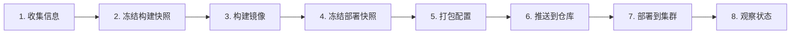
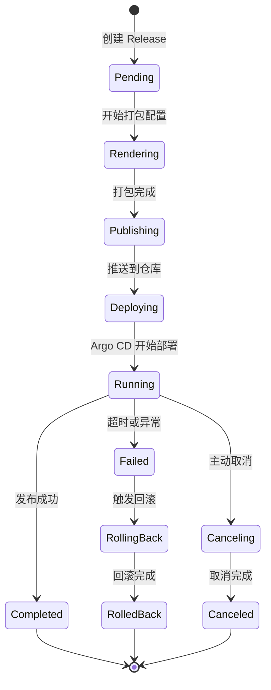

# 🧭 发布生命周期

<span class="df-badge">🧩 release-service</span> <span class="df-badge"> Tekton</span> <span class="df-badge">📦 OCI Registry</span> <span class="df-badge"> Argo CD</span> <span class="df-badge">👀 runtime-service</span>

在 DevFlow 中发布一个应用，会经历 8 个阶段。这个流程由 `release-service` 牵头，串起 `meta-service`、`config-service`、`network-service`、Tekton、OCI Registry、Argo CD 和 `runtime-service`。

如果发布过程中用户点了取消，`release-service` 会尽量把发布停在当前阶段，保留已经创建的快照、执行记录和状态信息，并在可安全停止的边界上终止后续动作。

---

## 🗺️ 整体流程



这 8 个阶段不是所有阶段都能随时取消：

- 阶段 1-2 取消最容易，只要停止继续收集与创建后续快照
- 阶段 3-6 取消要看外部系统是否已经开始执行，通常是“停止后续推进 + 标记取消”
- 阶段 7-8 取消最敏感，因为可能已经涉及集群同步和流量切换，只能做“安全中止”或“进入回滚”

---

## 📥 阶段 1：收集发布上下文

**谁在干活**：`release-service`

你在 Console 上点了"发布"后，`release-service` 先去收集这次发布需要的上下文：

> "meta-service，这个应用属于哪个项目，目标环境是谁？"
> "config-service，这个应用和环境的工作负载配置是什么？"
> "network-service，这个应用暴露哪些 Service 和 Route？"

**输出**：一份完整的发布上下文

---

## 🧊 阶段 2：冻结构建快照（Manifest）

**谁在干活**：`release-service`

release-service 把阶段 1 收集到的信息打包成第一份快照，叫 **Manifest**：

```
应用: order-service
代码版本: main @ a1b2c3d4
基础配置: 3 副本 / 1Gi 内存 / 健康检查...
网络拓扑: 暴露 80 端口...
```

Manifest 一旦创建就**不能再改**。它记录了"这个应用在构建时刻长什么样"。

**输出**：Manifest ID

---

## 🏗️ 阶段 3：触发构建

**谁在干活**：`release-service` 触发 Tekton Pipeline

`release-service` 通知 Tekton："去构建这个版本的镜像"。

Tekton 开始跑标准流水线：

```
拉代码 → 静态扫描 → 跑测试 → 构建镜像
→ 生成 SBOM → 签名镜像 → 漏洞扫描 → 推送镜像仓库
```

构建完成后，release-service 把镜像地址更新到 Manifest 里。

**输出**：镜像 digest、SBOM、签名证明

---

## 🎫 阶段 4：冻结部署快照（Release）

**谁在干活**：`release-service`

构建成功后，release-service 创建第二份快照，叫 **Release**：

```
关联的构建: Manifest m-001
目标环境: production
环境配置: DB_HOST=prod-db, LOG_LEVEL=warn...
网络规则: host=order.example.com, TLS=true...
发布策略: Canary
```

Release 也**不能再改**。它记录了"这次发布要部署到哪、用什么配置"。

**输出**：Release ID

---

## 📦 阶段 5：渲染部署包

**谁在干活**：`release-service`

release-service 把所有配置叠加起来，生成最终的 Kubernetes 部署包：

```
WorkloadConfig（基础运行规格）
+ AppConfig（环境特殊配置）
+ Service（网络端口）
+ Route（外部访问规则）
= 完整的 K8s manifest
```

不同的发布策略会生成不同的资源：

| 策略 | 生成什么 |
|------|---------|
| Rolling | Deployment + Service |
| Canary | Rollout + VirtualService + DestinationRule |
| Blue-Green | Rollout + Active Service + Preview Service |

**输出**：完整的 K8s manifest bundle

---

## 📤 阶段 6：推送到仓库

**谁在干活**：`release-service` → OCI Registry

release-service 把渲染好的部署包打包成 OCI artifact，推送到 OCI Registry。

这样做的好处是：部署包和镜像放在一起，Argo CD 从一个地方就能拉齐所有东西。

**输出**：OCI artifact URL

---

## 🚀 阶段 7：部署到集群

**谁在干活**：`release-service` 触发 Argo CD，Argo CD 执行同步

`release-service` 创建 Argo CD Application，告诉它："去这个仓库拉取部署包，同步到生产集群"。

Argo CD 开始干活：

```
拉取 bundle → 解析 K8s 资源 → 同步到集群
→ Rolling: 逐步替换 Pod
→ Canary: 先给 10% 流量
→ Blue-Green: 先部署到 Preview
```

**输出**：Argo CD Application 状态

### 可以在哪些时点取消

- 在创建 Release 之前取消：直接结束本次发布，不进入后续阶段
- 在 Manifest 创建后取消：保留 Manifest，Release 不再创建
- 在 Release 创建后、部署前取消：保留快照，但不再触发后续部署
- 在部署中取消：停止继续推进，必要时转入回滚
- 在观察期取消：停止继续观测或流量推进，按当前状态冻结并回滚

---

## 👀 阶段 8：观察状态

**谁在干活**：`runtime-service`

`runtime-service` 盯着 Kubernetes，实时看 Pod 的状态变化，然后回写给 `release-service`：

> "新版本 3/10 个 Pod 已经 Ready"
> "Canary 10% 流量切换完成，正在观察指标"

你在 Console 上看到的发布进度条、Pod 状态、流量切换百分比，全部来自这里。

**输出**：实时发布状态

### 取消时怎么处理

- 如果还没触发后续同步，就直接停止继续观察
- 如果已经进入集群同步，就先标记取消，再判断是否需要中止或回滚
- 如果已经切流到生产，就不能当成“简单取消”，而要按回滚处理

---

## 🔄 Release 状态机

Release 从创建到完成，会经历以下状态：



### 状态说明

| 状态 | 含义 | 对应阶段 |
|------|------|---------|
| Pending | 刚创建，等待开始 | 阶段 4 |
| Rendering | 正在叠加配置生成 K8s manifest | 阶段 5 |
| Publishing | 正在把包推送到镜像仓库 | 阶段 6 |
| Deploying | Argo CD 正在同步资源 | 阶段 7 |
| Running | 正在执行发布策略 | 阶段 7 |
| Completed | 发布成功 | 阶段 8 |
| Failed | 发布失败 | — |
| Canceling | 正在主动取消 | — |
| Canceled | 取消完成 | — |
| RollingBack | 正在回滚 | — |
| RolledBack | 回滚完成 | — |

---

## 🧠 关键设计

### 为什么先冻结 Manifest，再冻结 Release？

因为构建和部署是两个独立的过程：

- **Manifest** 在构建前创建，记录"要构建什么"
- **Release** 在构建成功后创建，记录"要部署到哪"

如果构建失败，Manifest 已经存在但 Release 不会创建。你可以修复问题后重新构建，不用从头再收集信息。

### 为什么两份快照都要不可变？

假设发布后出了问题，你想回滚。如果快照是可变的，回滚时你可能会意外拿到一个"被同事改过"的配置，导致回滚也失败。

不可变快照保证了：**回滚到什么时刻，就精确恢复到那个时刻的状态**。

---

## ❌ 取消发布时应该怎么做

取消不是“把记录删掉”，而是“停止继续推进并保留可追溯证据”。

### 取消原则

- 能停就停，但不破坏已创建的快照
- 不删除 Manifest / Release / Intent 记录
- 不把取消伪装成成功
- 如果已经进入集群同步或切流，优先保证安全，再决定是取消还是回滚

### 取消后的推荐结果

| 当前阶段 | 推荐动作 | 结果状态 |
|----------|----------|----------|
| 收集上下文 / 创建 Manifest | 直接中止 | Canceled |
| 触发构建 / 渲染前 | 停止继续推进 | Canceled |
| 渲染 / 推送中 | 标记取消，等待当前动作收敛 | Canceling → Canceled |
| 已进入 Argo CD 同步 | 先停止后续推进，再视情况中止或回滚 | Canceling → Canceled / RollingBack |
| 已切流 / 已观察中 | 不建议只做取消，优先走回滚 | RollingBack → RolledBack |

### 取消后系统应保留什么

- 这次发布的 `release_id`
- 关联的 `manifest_id`
- 当前阶段和最后一次状态
- 取消发起人和取消时间
- 最后一个可用的 Trace / Log / Event

### 取消后不应该做什么

- 不要直接删除发布记录
- 不要把 `Failed` 误写成 `Completed`
- 不要在已经切流后只做“取消”，不做回滚
