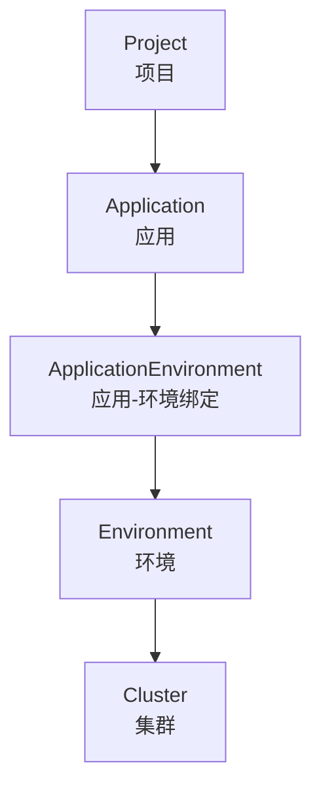
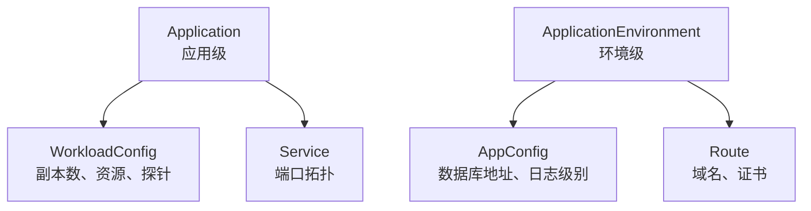
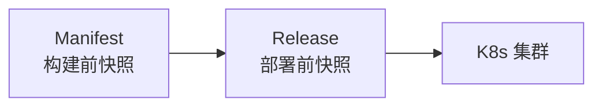

# 核心概念

DevFlow 中有一些关键概念，理解它们就能理解整个平台的工作方式。

---

## 概念地图



**一句话理解**：

> **Project** 是文件夹，**Application** 是文件，**Environment** 是运行环境，**Cluster** 是物理机器。你把文件放到文件夹里，再把它部署到某个环境的某台机器上。

---

## 四个层级

DevFlow 的资源模型分为四个层级，从大到小：

### 第一层：Project（项目）

业务域的顶层组织。比如：

```
Project: 电商中台
  ├─ 订单系统
  ├─ 支付系统
  └─ 库存系统
```

### 第二层：Application（应用）

一个可独立构建和部署的服务。比如：

```
Application: order-service
  代码仓库: github.com/company/order-service
  部署类型: Canary
```

**部署类型**决定了这个应用默认用什么方式发布：

| 类型 | 含义 |
|------|------|
| normal | 滚动更新 |
| canary | 灰度发布 |
| blue-green | 蓝绿部署 |

### 第三层：Environment（环境）

应用运行的逻辑环境。比如：

```
Environment: test
  所在集群: dev-cluster
  命名空间: order-test
```

常见环境：开发（dev）、测试（test）、预发布（staging）、生产（prod）。

### 第四层：ApplicationEnvironment（应用-环境绑定）

一个应用部署到一个环境，就形成了绑定关系。这个绑定是配置差异的载体：

```
order-service + test 环境 = order-service-test
  └─ AppConfig（测试环境特殊配置）
  └─ Route（测试环境入口规则）
```

---

## 配置与网络的分层

理解了上面的层级，配置和网络的分层就好理解了：

### 不随环境变化的（属于 Application）

- **WorkloadConfig** — 应用跑几个副本、用多少 CPU、健康检查怎么做
- **Service** — 应用暴露了哪些端口

### 随环境变化的（属于 ApplicationEnvironment）

- **AppConfig** — 这个环境下的数据库地址、日志级别
- **Route** — 这个环境下的域名、HTTPS 证书



---

## 发布的两个快照

DevFlow 最核心的设计是**冻结点** — 发布过程中创建两份不可变快照：

### Manifest — 构建前快照

回答：**这个应用在构建时刻长什么样？**

包含：
- 代码版本（git revision + commit hash）
- 构建出来的镜像
- WorkloadConfig 快照
- Service 快照

### Release — 部署前快照

回答：**这个版本要部署到哪个环境？用什么配置？**

包含：
- 关联的 Manifest
- 目标环境
- AppConfig 快照
- Route 快照
- 发布策略（Rolling / Canary / Blue-Green）



**为什么要两份快照？**

因为构建和部署是两个独立的过程：
- Manifest 可以在不同环境复用（同一个镜像发到测试和生产）
- Release 绑定特定环境（测试配置和生产配置不一样）
- 出了问题回滚时，回滚的是 Release 快照，完全可重现

## 概念速查表

| 概念 | 一句话解释 | 类比 |
|------|-----------|------|
| Project | 项目，组织多个应用 | 文件夹 |
| Application | 单个可部署的服务 | 文件 |
| Environment | 运行环境 | 运行环境（dev/test/prod）|
| Cluster | Kubernetes 集群 | 物理机器 |
| WorkloadConfig | 应用级运行时基线 | 出厂设置 |
| AppConfig | 环境级配置差异 | 环境适配器 |
| Service | 应用暴露的端口 | 插座 |
| Route | 外部流量入口规则 | 门牌号 |
| Manifest | 构建前冻结快照 | 照片 |
| Release | 部署前冻结快照 | 电影票（指定场次座位）|
