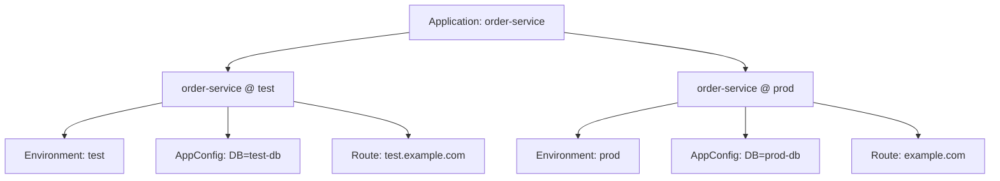
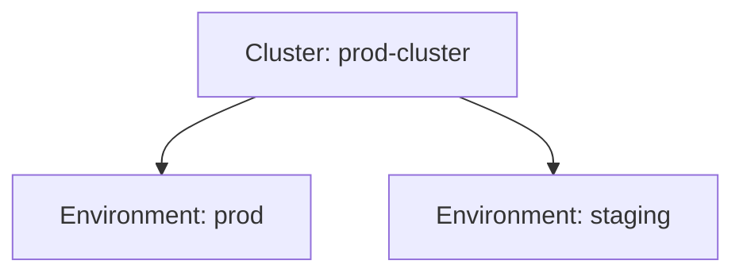

# Environment 与 Cluster

## Cluster — Kubernetes 集群

Cluster 就是 Kubernetes 集群，是应用真正跑起来的地方。

### 例子

```
Cluster: dev-cluster
  位置: 北京机房
  用途: 开发测试

Cluster: prod-cluster
  位置: 上海机房
  用途: 生产环境
```

DevFlow 支持接入多个集群，你可以把不同环境映射到不同集群，甚至把一个环境的应用分发到多个集群。

---

## Environment — 环境

Environment 是一个**逻辑运行环境**，比如开发、测试、预发布、生产。

### 例子

```yaml
名称: production
所在集群: prod-cluster
命名空间: order-prod
```

```yaml
名称: test
所在集群: dev-cluster
命名空间: order-test
```

### 环境隔离

Environment 通过三种机制实现隔离：

1. **命名空间隔离** — 每个 Environment 对应一个 Kubernetes namespace
2. **配置隔离** — AppConfig 和 Route 属于 ApplicationEnvironment，不同环境完全独立
3. **网络隔离** — 不同环境的 Route 绑定不同的域名和证书

---

## ApplicationEnvironment — 应用绑定到环境

当应用要部署到某个环境时，需要先建立绑定关系。这个绑定关系叫 **ApplicationEnvironment**。

### 为什么要先绑定

想象你想把 `order-service` 部署到 `test` 环境：

1. 先创建绑定：`order-service` + `test` = `order-service-test`
2. 然后给这个绑定配置环境专属的东西：
   - AppConfig（测试数据库地址、debug 日志）
   - Route（测试域名）



### 绑定后有什么用

绑定后，你就可以：
- 为不同环境配置不同的数据库地址
- 为不同环境配置不同的域名
- 分别查看每个环境下的发布历史

---

## 常见环境划分

| 环境 | 用途 | 发布频率 | 策略建议 |
|------|------|---------|---------|
| dev | 开发调试 | 随时 | Rolling |
| test | 功能测试 | 每天多次 | Rolling |
| staging | 集成测试 | 每天 1-2 次 | Canary |
| prod | 生产环境 | 按需 | Canary 或 Blue-Green |

---

## Cluster 和 Environment 的关系



**规则**：
- 一个 Cluster 可以承载多个 Environment
- 一个 Environment 只能属于一个 Cluster（但可以跨集群扩展）
- 不同 Environment 使用不同的 namespace 隔离
