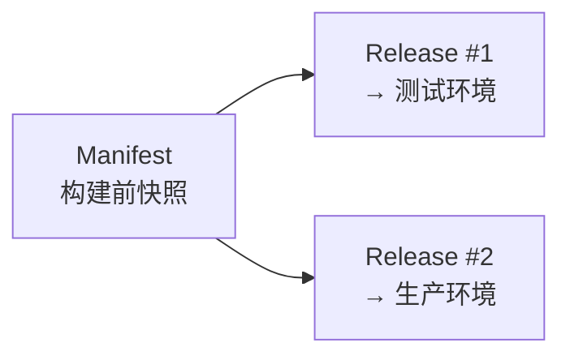

# Manifest 与 Release

Manifest 和 Release 是 DevFlow 最核心的设计。理解它们，就理解了 DevFlow 为什么能做到**安全发布、一键回滚**。

---

## 问题背景

传统的发布方式有什么问题？

> 小明在周一发布了 order-service v2.0。周三发现有问题，想回滚。但他发现：
> - 配置文件已经被同事改过好几次
> - 数据库迁移脚本不确定是哪个版本跑的
> - 镜像 tag 也不记得了
> 
> 回滚变成了猜谜游戏。

DevFlow 的解决方案是：**发布前冻结两份不可变快照**。

---

## Manifest — 构建前快照

Manifest 记录了**构建时刻**的应用完整状态。

### 它包含什么

```yaml
manifest:
  应用: order-service
  代码版本: main @ a1b2c3d4
  构建镜像: registry.example.com/order-service:a1b2c3d4
  基础配置快照: 3 副本 / 1Gi 内存 / 健康检查...
  网络拓扑快照: 暴露 80 端口(HTTP)...
```

### 它的特点

- **构建时创建** — CI 构建成功后自动生成
- **不可变** — 创建后不能再改
- **不包含环境信息** — 同一个 Manifest 可以发到测试、生产任何环境

### 类比

Manifest 就像一张照片：拍的是应用在某个代码版本的样子。照片不会变，你可以把这张照片给任何人看。

---

## Release — 部署前快照

Release 记录了**部署时刻**的完整状态，绑定了一个 Manifest 和一个目标环境。

### 它包含什么

```yaml
release:
  关联的 Manifest: m-001（order-service @ a1b2c3d4）
  目标环境: production
  环境配置快照: DB_HOST=prod-db, LOG_LEVEL=warn...
  网络规则快照: host=order.example.com, TLS=true...
  发布策略: Canary
  部署包: oci://registry.example.com/bundles/...
```

### 它的特点

- **部署时创建** — 构建成功后、部署前创建
- **不可变** — 创建后不能再改
- **绑定环境** — 每个 Release 对应一个具体的环境

### 类比

Release 就像一张电影票：指定了看哪部电影（Manifest）、哪个影院（Environment）、哪个场次策略（Rolling/Canary/Blue-Green）。票买了就不能改。

---

## 为什么需要两份快照



**场景 1：同一个版本发多个环境**

order-service v2.0 构建完成后：
- 发到测试环境 → Release #1
- 发到生产环境 → Release #2

两个 Release 共用同一个 Manifest（同一套代码、同一个镜像），但环境配置不同。

**场景 2：回滚**

生产环境出了问题，想回滚到上周的版本：
- 直接找到上周的 Release 快照
- 重新部署这个 Release
- 由于 Release 是不可变的，回滚后的状态和上周**完全一致**

---

## 发布状态

Release 有自己的状态机：

```
Pending → Rendering → Publishing → Deploying → Running → Completed
                                        ↘ Failed → RollingBack → RolledBack
```

| 状态 | 含义 |
|------|------|
| Pending | 刚创建，等待开始 |
| Rendering | 正在把配置打包成 K8s manifest |
| Publishing | 正在把包推送到镜像仓库 |
| Deploying | Argo CD 正在部署 |
| Running | 正在执行发布策略（Rolling/Canary/Blue-Green）|
| Completed | 发布成功 |
| Failed | 发布失败 |
| RollingBack | 正在回滚 |
| RolledBack | 回滚完成 |

---

## 回滚

DevFlow 支持两种回滚方式：

### 1. Release 回滚（推荐）

找到上一个成功的 Release，重新部署它。因为 Release 是不可变的，回滚后的状态和当时**完全一致**。

```
当前: Release #5 (v2.1) 有问题
回滚到: Release #4 (v2.0) 
结果: 完全恢复到 v2.0 发布时的状态
```

### 2. Argo CD 回滚

通过 Argo CD 的同步历史快速回滚，适合 K8s 层面的紧急恢复。

---

## 总结

| | Manifest | Release |
|--|----------|---------|
| 什么时候创建 | 构建前 | 部署前 |
| 包含什么 | 代码版本、镜像、基础配置 | Manifest + 环境 + 策略 |
| 能不能复用 | 能（跨环境） | 不能（绑定环境） |
| 变了怎么办 | 重新构建 | 创建新的 Release |
| 回滚时有什么用 | 知道回滚到哪个代码版本 | 知道当时的完整状态 |
