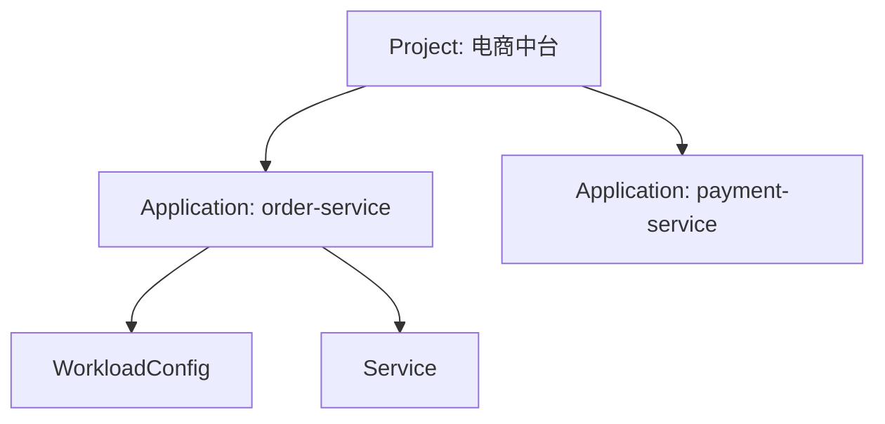

# 📁 Project 与 Application

## Project — 项目

Project 是 DevFlow 中最顶层的组织单元。你可以把它理解成一个**文件夹**，把相关的应用放在一起。

---

## 为什么需要分层

没有 Project/Application 分层时，你的应用列表可能是这样的：

```
payment-gateway
order-service
inventory-service
user-service
analytics-collector
analytics-processor
analytics-api
```

8 个服务混在一起，新来的同事完全不知道谁和谁有关系。

有了分层之后：

```
电商中台
  ├─ payment-gateway
  ├─ order-service
  ├─ inventory-service
  └─ user-service

数据中台
  ├─ analytics-collector
  ├─ analytics-processor
  └─ analytics-api
```

一目了然。每个团队只看自己负责的项目，不会被别人家的服务干扰。

> 分层不仅是组织问题，更是**权限隔离**的基础。你可以给"数据中台"团队只开放数据中台的权限，他们看不到电商中台的任何东西。

### 例子

```
Project: 电商中台
  ├─ order-service（订单服务）
  ├─ payment-service（支付服务）
  ├─ inventory-service（库存服务）
  └─ user-service（用户服务）
```

```
Project: 数据中台
  ├─ data-collector
  ├─ data-processor
  └─ data-api
```

### 什么时候用

- 按业务域划分（电商、支付、数据中台）
- 按团队划分（前端团队、后端团队）
- 按合规要求划分（需要独立权限隔离的业务）

---

## Application — 应用

Application 是 DevFlow 中**最核心的实体**。它代表一个可独立构建和部署的服务。

### 一个应用包含什么

```yaml
名称: order-service
所属项目: 电商中台
代码仓库: github.com/company/order-service
```

### 当前实现里 Application 主要保存什么

当前 `devflow-service` 里的 `Application` 主要保存：

- 所属 `Project`
- 应用名称
- 代码仓库地址（`repo_address`）
- 描述和扩展标签

发布策略不是 `Application` 的创建字段，而是在创建 `Release` 时指定。

### 应用和 WorkloadConfig

每个应用有一个对应的 **WorkloadConfig**，定义它的运行时基线（副本数、资源、探针等）。WorkloadConfig 不随环境变化，是应用的固有属性。

### 应用和 Service

每个应用可以有一个或多个 **Service**，定义它暴露的网络端口。Service 也不随环境变化。

---

## 它们的关系



**规则**：
- 一个 Project 可以有多个 Application
- 一个 Application 只能属于一个 Project
- 一个 Application 有且只有一个 WorkloadConfig
- 一个 Application 可以有一个或多个 Service
