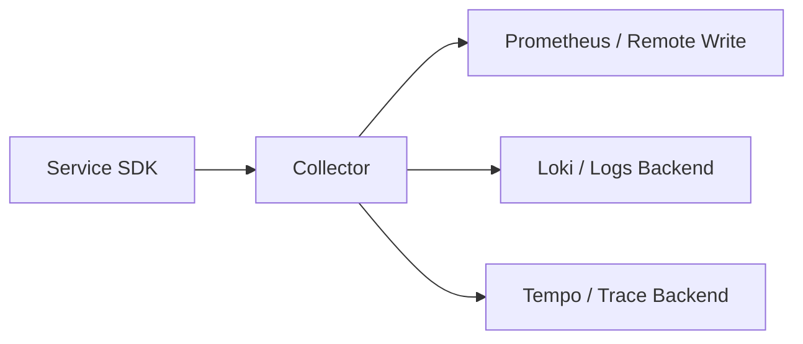

# 🛠️ Collector 生产排障 Runbook

Runbook OTel Collector Oncall SRE

这页不是讲“Collector 应该怎么配置”，而是讲：

> **当线上 Metrics / Logs / Traces 突然断流、缺字段、延迟变高时，值班的人应该按什么顺序排查？**

适合的读者：

- 值班工程师
- SRE / 平台工程师
- 负责维护 observability 基础设施的开发者

读完后，你应该能完成一件事：

> **在 5~10 分钟内判断问题更可能出在服务侧、Collector 侧，还是后端存储侧。**

---

## 🧭 先记排障总原则

Collector 在整条链路里的位置很特殊：

所以 Collector 故障通常会表现成三类：

1. **入口没收到数据** — 问题更可能在服务侧或网络侧
2. **收到了但没转发出去** — 问题更可能在 Collector 自身
3. **转发出去了但查询不到** — 问题更可能在后端存储 / 查询侧

先判断属于哪一类，效率最高。

---

## 🚦 先按症状分流

| 症状 | 第一怀疑对象 |
|------|--------------|
| 所有服务的 Trace / Log / Metric 同时大量消失 | Collector 整体故障 / 网络故障 |
| 只有某一个服务数据消失 | 服务自身配置 / SDK / 网络 |
| Trace 有，Log 没有 | logs pipeline / exporter / backend |
| Log 有，Trace 没有 | traces pipeline / SDK / sampling |
| 字段缺失，尤其是 `k8s.*` 缺失 | `k8sattributes` processor |
| 只有 `devflow.*` 缺失 | 服务代码没打，不是 Collector 问题 |
| 延迟突然升高，数据最后还是到达 | batch / exporter / backend 背压 |

这一步先帮助你避免“明明是服务代码没打字段，却一直在查 Collector”。

---

## ① 先看 Collector 自己活着没有

### 必查项

- [ ] Collector Pod 是否 Running
- [ ] Collector Pod 是否频繁重启
- [ ] Collector 是否有 OOMKilled / CrashLoopBackOff
- [ ] Collector 所在节点是否异常

### 最先看的信号

- Pod 状态
- 重启次数
- 最近 5~10 分钟日志
- CPU / 内存是否顶满

### 常见结论

#### 情况 A：Pod 根本没起来

优先怀疑：

- 配置文件语法错误
- 镜像 / 启动参数错误
- Secret / ConfigMap 缺失

#### 情况 B：Pod 活着，但频繁重启

优先怀疑：

- 内存限制太低
- exporter 连接阻塞导致堆积
- processor 配置过重

#### 情况 C：Pod 活着，也不重启

说明问题更可能在：

- pipeline 某一段堵住
- 后端不可达
- 某个 processor 没生效

---

## ② 判断是“没收到”还是“没发出”

这是最关键的一步。

### 如果完全没收到数据

优先检查：

- 服务端 `OTEL_EXPORTER_OTLP_ENDPOINT` 是否正确
- 服务到 Collector 的网络是否通
- OTLP gRPC/HTTP 端口是否匹配
- 是否最近改过 Service / DNS / NetworkPolicy

### 典型表现

- 所有后端都没数据
- Collector 日志里几乎看不到接收活动
- 只有应用侧报 exporter connect error

### 如果收到但没发出

优先检查：

- exporter 是否报错
- 后端 endpoint 是否可达
- TLS / 鉴权是否异常
- batch / queue 是否积压

### 典型表现

- Collector 日志里有接收记录
- 同时伴随 exporter retry / timeout / unavailable
- 某一种信号（比如 traces）持续失败，其他信号正常

---

## ③ Trace 断流怎么查

### 先问 3 个问题

1. 所有服务都没有 Trace，还是只有一个服务没有？
2. 入口 Span 没了，还是只有跨服务子 Span 没了？
3. Trace 完全没有，还是只有少量缺失？

### 常见根因

#### 只有一个服务没 Trace

更可能是服务侧问题：

- 没初始化 tracer provider
- middleware 没挂上
- endpoint 配错
- sampling 配得太激进

#### 所有服务都没 Trace

更可能是 Collector / Tempo / traces exporter 问题：

- traces pipeline 配置错误
- Tempo 不可达
- exporter 持续 retry

#### 入口 Span 有，跨服务子 Span 没了

更可能是上下文传播问题：

- HTTP / gRPC headers 没传
- 某个服务没配 propagator
- 某个下游重建了 root trace

---

## ④ Log 断流怎么查

### 先问 3 个问题

1. 是完全没有日志，还是只有结构化字段没了？
2. 是某个服务没日志，还是所有服务都没日志？
3. 是日志没到 Collector，还是到了 Collector 没进 Loki？

### 常见根因

#### 只有 `k8s.*` 丢了

优先查：

- `k8sattributes` processor 是否启用
- RBAC 是否足够
- Pod association 是否失效

#### 只有 `devflow.*` 丢了

优先查：

- 服务代码有没有把字段打到日志里
- 日志库是否丢弃了结构化字段
- 日志与 Span 字段命名是否一致

#### 所有日志都没了

优先查：

- logs pipeline 是否存在
- Loki exporter / backend 是否可达
- 是否发生了日志量暴涨导致限流或丢弃

---

## ⑤ Metrics 异常怎么查

### 典型症状

- 仪表盘全空
- 某些 HTTP 指标突然消失
- label cardinality 突然暴涨
- 查询延迟明显升高

### 常见根因

#### 指标全空

优先查：

- metrics pipeline 是否存在
- Prometheus exporter / scrape 是否正常
- 端口是否暴露

#### 指标还在，但 label 失控

优先查：

- 服务代码是否新加了高基数字段进 metrics labels
- 是否把 `request_id` / 原始 URL / 用户 ID 打进 labels
- Collector 是否缺少 drop / filter 保护

#### 指标有，但聚合维度怪异

优先查：

- `http.route` 是否退化成原始 URL
- `service.name` 是否缺失
- 多环境是否共用了错误的 `deployment.environment.name`

---

## ⑥ `k8sattributes` 不生效怎么查

Collector 在 DevFlow 中最常见的问题之一，就是 `k8s.*` 字段没补上。

### 优先检查

- [ ] `k8sattributes` processor 是否真的挂在 pipeline 中
- [ ] Collector 的 ServiceAccount / RBAC 是否允许读取 Pod 元数据
- [ ] Pod association 策略是否适配当前部署方式
- [ ] 是否存在 sidecar / gateway 模式导致 association 失效

### 典型表现

- 有 Trace / Log / Metric
- 但缺少：
  - `k8s.namespace.name`
  - `k8s.pod.name`
  - `k8s.node.name`

### 结论判断

- **只有 `k8s.*` 丢** → 大概率是 Collector enrichment 问题
- **只有 `devflow.*` 丢** → 大概率是服务代码问题

---

## ⑦ 什么时候该怀疑后端，不该再查 Collector

下面这些情况出现时，问题已经更像后端：

- Collector 日志显示 exporter 成功发送
- debug exporter 能看到数据内容
- 只有 Grafana / Tempo / Loki 查询不到
- 同一时间其他 pipeline 正常，仅某一个 backend 异常

### 这时应该转向检查

- Tempo / Loki / Prometheus 自身健康
- 存储后端容量 / 索引 / 查询超时
- 后端鉴权或租户配置
- 查询时间范围 / label 条件是否正确

---

## 🧪 生产环境最小排障顺序

真的值班时，不要乱跳。建议固定走这 7 步：

1. **看症状范围**：单服务还是全局
2. **看 Collector Pod 健康**：是否重启、OOM、Crash
3. **看 Collector 日志**：是否有 receive / export error
4. **分信号类型**：traces / logs / metrics 哪条 pipeline 出问题
5. **看 enrichment**：`k8s.*` 是否存在
6. **看业务字段**：`devflow.*` 是否存在
7. **最后再查后端**：Tempo / Loki / Prometheus

这个顺序的核心是：

> **先判断故障层级，再判断字段层级。**

---

## 🚨 常见误判

### 误判 1：`devflow.release.id` 没了，就怪 Collector

错因：

- `devflow.*` 本来就该由服务代码设置
- Collector 负责的是 `k8s.*` / `cloud.*`

### 误判 2：Grafana 查不到，就直接怪服务没打点

错因：

- 数据可能已经进 Collector，但没成功写入后端
- 也可能是查询条件错了

### 误判 3：只有一个 namespace 出问题，却去重启整个 Collector

错因：

- 很可能只是某个服务的 endpoint / DNS / NetworkPolicy 问题
- 全局重启只会扩大影响面

---

## ✅ Runbook 完成标准

如果你按这页排查，最终至少应该能给出一个明确结论：

- 问题更像**服务侧接入问题**
- 问题更像**Collector pipeline 问题**
- 问题更像**后端存储 / 查询问题**

只要能把问题收敛到这三类之一，后续处理就会快很多。

---

## 关联阅读

- [OTel Collector 配置模板](../collector/)
- [字段命名与来源边界](../attributes/)
- [OTel 接入检查清单](../onboarding-checklist/)
- [发布链路 Trace 示例](../release-trace-example/)
