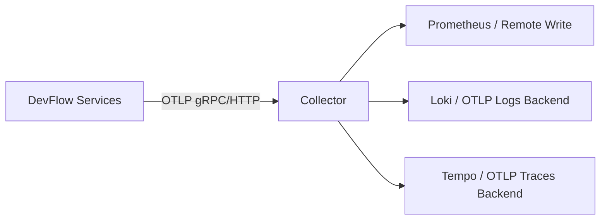

# 🧰 OTel Collector 配置模板

<span class="df-badge"> Collector</span> <span class="df-badge">k8sattributes</span> <span class="df-badge">resource processor</span>

这一页解决一个落地问题：

> **既然已经明确了“哪些标签该由 Collector 注入”，那 Collector 应该怎么配？**

下面给一份适合 DevFlow 的最小推荐模板。目标不是覆盖所有高级玩法，而是先把下面 3 件事做对：

1. 统一接收应用侧上报的 Metrics / Logs / Traces
2. 自动补齐 Kubernetes 公共元数据
3. 给所有 telemetry 统一补充环境与集群级 Resource Attributes

---

## 🎯 这个模板负责什么

Collector 这一层，建议只做**运行环境增强**和**统一转发**：

| 负责内容 | 示例 |
|----------|------|
| K8s 元数据补齐 | `k8s.pod.name` `k8s.namespace.name` `k8s.node.name` |
| 集群级公共字段 | `deployment.environment` `k8s.cluster.name` `cloud.region` |
| 统一导出 | Prometheus / Loki / Tempo / OTLP backend |
| 基础清洗 | 删除无用属性、限制标签爆炸 |

不建议放在 Collector 做的事：

- 生成 `devflow.release.id`
- 推断 `devflow.application.id`
- 拼接复杂业务语义
- 从日志正文里猜业务字段

这些还是应该由服务代码自己设置。

---

## 🧱 最小推荐架构



Collector 作为统一入口：

- 服务只需要知道一个 OTLP endpoint
- 平台侧统一做 enrichment、过滤、路由
- 后端替换时，不需要每个服务都改代码

---

## ✅ 推荐配置模板

```yaml
receivers:
  otlp:
    protocols:
      grpc:
        endpoint: 0.0.0.0:4317
      http:
        endpoint: 0.0.0.0:4318

processors:
  memory_limiter:
    check_interval: 1s
    limit_mib: 512
    spike_limit_mib: 128

  batch:
    send_batch_size: 1024
    timeout: 1s

  k8sattributes:
    auth_type: serviceAccount
    passthrough: false
    extract:
      metadata:
        - k8s.namespace.name
        - k8s.pod.name
        - k8s.node.name
        - k8s.deployment.name
        - k8s.statefulset.name
        - k8s.daemonset.name
        - k8s.container.name
    pod_association:
      - sources:
          - from: resource_attribute
            name: k8s.pod.ip
      - sources:
          - from: connection

  resource:
    attributes:
      - key: deployment.environment
        value: prod
        action: upsert
      - key: k8s.cluster.name
        value: devflow-prod
        action: upsert
      - key: cloud.region
        value: cn-hangzhou
        action: upsert
      - key: cloud.availability_zone
        value: cn-hangzhou-h
        action: upsert

  attributes/drop_high_cardinality:
    actions:
      - key: http.request.header.authorization
        action: delete
      - key: db.statement.parameters
        action: delete

exporters:
  debug:
    verbosity: basic

  otlp/tempo:
    endpoint: tempo.observability.svc.cluster.local:4317
    tls:
      insecure: true

  otlp/loki:
    endpoint: loki.observability.svc.cluster.local:4317
    tls:
      insecure: true

  prometheus:
    endpoint: 0.0.0.0:8889

service:
  pipelines:
    traces:
      receivers: [otlp]
      processors: [memory_limiter, k8sattributes, resource, attributes/drop_high_cardinality, batch]
      exporters: [otlp/tempo]

    logs:
      receivers: [otlp]
      processors: [memory_limiter, k8sattributes, resource, attributes/drop_high_cardinality, batch]
      exporters: [otlp/loki]

    metrics:
      receivers: [otlp]
      processors: [memory_limiter, k8sattributes, resource, batch]
      exporters: [prometheus]
```

---

## 🔍 逐段解释

### 1. `receiver: otlp`

作用：接收服务上报的数据。

推荐：

- gRPC 和 HTTP 都开
- 服务默认优先走 `4317` gRPC
- 保留 `4318` 给某些 SDK / sidecar / browser exporter 使用

---

### 2. `k8sattributes`

这是 DevFlow 场景里最重要的 processor。

它解决的是：

- 同一个 Trace/Log/Metric 到底来自哪个 Pod
- 属于哪个 namespace
- 跑在哪个 node 上
- 对应哪个 Deployment

推荐保留字段：

| 字段 | 为什么要留 |
|------|------------|
| `k8s.namespace.name` | 区分环境和租户边界 |
| `k8s.pod.name` | 定位单 Pod 问题 |
| `k8s.node.name` | 排查节点级异常 |
| `k8s.deployment.name` | 聚合到 workload 维度 |
| `k8s.container.name` | 多容器 Pod 时很有用 |

---

### 3. `resource`

这个 processor 用来补**整个集群共享**的 Resource Attributes。

适合放这里的字段：

- `deployment.environment`
- `k8s.cluster.name`
- `cloud.region`
- `cloud.availability_zone`
- 某些公司级统一租户标记（如果是稳定低基数）

不适合放这里的字段：

- `devflow.release.id`
- `devflow.application.id`
- `user.id`

这些不是平台公共资源属性。

---

### 4. `attributes/drop_high_cardinality`

这个 processor 用来做**防爆炸保护**。

Collector 层很适合统一删除：

- 敏感字段
- 高基数字段
- 明显不该长期保留的原始 payload 属性

常见例子：

| 删除字段 | 原因 |
|----------|------|
| `authorization` header | 敏感信息 |
| SQL 参数明文 | 可能泄露数据 |
| 原始 query string | 基数高且可能带隐私 |

---

## 🧩 和服务代码的分工

### 服务代码负责

- `devflow.project.id`
- `devflow.application.id`
- `devflow.environment.id`
- `devflow.release.id`
- `error.message`
- 关键业务指标 label

### Collector 负责

- `k8s.*`
- `cloud.*`
- `k8s.cluster.name`
- 导出、过滤、批处理、限流

最简单的原则：

> **Collector 负责“这个 telemetry 从哪里来”，服务代码负责“这个 telemetry 在处理什么业务”。**

---

## 🚀 服务侧对应配置

为了让 Collector 正常工作，服务 Deployment 至少应配置：

```yaml
env:
  - name: OTEL_EXPORTER_OTLP_ENDPOINT
    value: http://otel-collector.observability.svc.cluster.local:4317
  - name: OTEL_EXPORTER_OTLP_PROTOCOL
    value: grpc
  - name: OTEL_SERVICE_NAME
    value: meta-service
  - name: OTEL_RESOURCE_ATTRIBUTES
    value: service.version=1.4.2,deployment.environment=prod,service.namespace=devflow
```

这样分工会很清楚：

- 服务声明自己是谁
- Collector 补充它跑在哪
- 服务代码补充它正在处理什么业务对象

---

## 📦 DevFlow 推荐最小字段集合

如果你只想先把系统接起来，推荐最小必备集合如下：

### 服务启动层

- `service.name`
- `service.version`
- `deployment.environment`

### 服务代码层

- `devflow.application.id`
- `devflow.release.id`（发布链路里）
- `error.message`（失败场景）

### Collector 层

- `k8s.cluster.name`
- `k8s.namespace.name`
- `k8s.pod.name`
- `k8s.node.name`

这 10 个左右的字段，已经够你把 Metrics / Logs / Traces 基本串起来了。

---

## ⚠️ 常见错误

### 错误 1：把业务 ID 放进 Collector

后果：Collector 需要理解业务语义，配置越来越脆弱。

### 错误 2：把 Pod/Node 信息写进业务代码

后果：每个服务都重复做一遍，而且不同语言实现不一致。

### 错误 3：把高基数字段打进 Metrics

后果：Prometheus / TSDB 存储和查询成本飙升。

### 错误 4：服务不配 `service.name`

后果：Telemetry 进了后端，但没法稳定按服务聚合。

---

## 🧭 你下一步该做什么

如果你正在落地 DevFlow observability，建议顺序是：

1. 先按本页把 Collector 跑起来
2. 再按 [公共 Attributes](../attributes/) 划清字段归属
3. 最后按 [Labels / Attributes 规范](../standard/) 统一命名

---

## 关联阅读

- [可观测性首页](../)
- [公共 Attributes](../attributes/)
- [Labels / Attributes 规范](../standard/)
