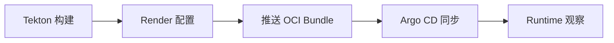

# 🚨 发布失败排障剧本

Release Tekton Argo CD Runtime

这页不是讲“发布流程是什么”，而是讲：

> **当一次发布失败时，值班的人应该先看哪一段、怎么缩小范围、怎么判断根因。**

适合的读者：

- 值班工程师
- `release-service` 维护者
- 平台工程师 / SRE

读完后，你应该能完成一件事：

> **把一次失败发布快速归类到 Tekton / Render / OCI / Argo CD / Runtime 五段中的某一段。**

---

## 🧭 先把失败分成 5 段

一次发布失败，通常不会“整个流程一起坏掉”，而是坏在某一段：

排障时最重要的不是一开始就追根到底，而是：

1. 先判断失败卡在哪一段
2. 再看这一段最典型的失败模式
3. 最后结合 Trace / Log / 状态字段收敛到根因

---

## 🚦 先按现象分流

| 现象 | 更可能卡在哪 |
|------|--------------|
| Release 很快失败，连镜像都没出来 | Tekton |
| 镜像有了，但 Release 停在 Rendering / Publishing | Render / OCI |
| Argo CD Application 没创建成功 | Argo CD 创建前后 |
| Argo CD 创建了，但一直不同步 | Argo CD 同步阶段 |
| Pod 拉起来了，但状态迟迟不 Ready | Runtime |
| Canary / Blue-Green 卡在观察期 | Runtime / Metrics Gate |
| 用户主动点了取消 | Cancel / Rollback |

先定位大段，后面排查就会快很多。

---

## ① Tekton 失败剧本

### 典型现象

- Release 创建后很快失败
- `tekton.TriggerPipelineRun` Span 结束在错误状态
- PipelineRun 状态是 Failed
- 日志停在 build / test / scan / push image 阶段

### 先查什么

- [ ] PipelineRun 是否真的被创建
- [ ] 失败发生在 clone / test / build / push 哪一步
- [ ] `devflow.manifest.id` 是否和本次发布一致
- [ ] `release-service` 日志里是否记录了 Tekton 回调错误

### 常见根因

- Git 凭证失效
- Dockerfile / 构建脚本错误
- 单元测试失败
- 镜像仓库推送权限不足
- Tekton workspace / PVC / serviceAccount 配置问题

### 最小判断标准

- **PipelineRun 没创建** → 更像 `release-service` 到 Tekton 的触发问题
- **PipelineRun 创建了但 Task 失败** → 更像 Tekton 构建链路问题

---

## ② Render 失败剧本

### 典型现象

- Release 状态停在 `Rendering`
- `release.RenderBundle` Span 耗时异常或报错
- 日志里出现 config merge / template render / manifest build error

### 先查什么

- [ ] AppConfig / WorkloadConfig / Route 是否都取到了
- [ ] `devflow.application.id` `devflow.environment.id` 是否正确
- [ ] 渲染失败是数据缺失还是模板错误
- [ ] 是否最近改过渲染逻辑或配置模型

### 常见根因

- 环境配置缺字段
- 模板变量缺失
- Route / Service 配置非法
- 不同配置层合并后产生冲突
- 发布策略需要的资源字段不完整

### 最小判断标准

- **还没进入推送仓库**，就已经失败 → 优先怀疑 Render
- **日志里能看到配置对象 ID，但 bundle 没生成** → 更像 Render 逻辑问题

---

## ③ OCI 推送失败剧本

### 典型现象

- Release 状态停在 `Publishing`
- `registry.PushBundle` Span 报错
- 构建成功、渲染成功，但 OCI artifact 没推上去

### 先查什么

- [ ] OCI Registry endpoint 是否可达
- [ ] 仓库认证是否过期
- [ ] bundle 大小是否异常
- [ ] 同一时间镜像推送是否也失败

### 常见根因

- Registry 权限不足
- 仓库地址错误
- 网络抖动 / TLS 问题
- Artifact tag / reference 冲突
- Registry 存储容量问题

### 最小判断标准

- **Render 成功，Argo CD 还没开始** → 很可能卡在 OCI 推送
- **镜像推送正常，但 bundle 推送失败** → 更像 artifact/reference 或仓库权限问题

---

## ④ Argo CD 失败剧本

### 典型现象

- `argocd.CreateApplication` Span 失败
- 或 Application 创建成功但一直 OutOfSync / Degraded
- Release 状态停在 `Deploying` / `Running`

### 先查什么

- [ ] Argo CD Application 是否创建成功
- [ ] Sync 报错是在拉 bundle、解析资源，还是 apply 资源阶段
- [ ] 目标 cluster / namespace 是否正确
- [ ] 是否存在 RBAC / CRD / admission webhook 拒绝

### 常见根因

- Argo CD API 权限问题
- OCI source reference 错误
- K8s 资源 schema 非法
- 目标 namespace 不存在
- CRD 未安装或版本不兼容
- webhook / policy 阻断 apply

### 最小判断标准

- **Application 都没建起来** → 更像 `release-service` 调 Argo CD API 问题
- **Application 建起来了但 Sync 失败** → 更像 Argo CD / K8s 资源问题

---

## ⑤ Runtime 失败剧本

### 典型现象

- Argo CD 显示已同步，但 Release 最终 Failed
- `runtime-service.WatchReleaseStatus` Span 耗时很长
- Pod 创建了，但一直不 Ready
- Canary 一直停在观察阶段

### 先查什么

- [ ] 新 Pod 是否真的创建出来了
- [ ] 是启动失败、探针失败，还是流量切换后错误率升高
- [ ] `k8s.workload.name` `k8s.pod.name` 是否能定位到具体实例
- [ ] runtime-service 回写的状态最后卡在哪一类事件上

### 常见根因

- 镜像启动失败
- Readiness / Liveness probe 配置错误
- ConfigMap / Secret 缺失
- 数据库 / 下游依赖不可达
- Canary 新版本错误率高
- Runtime 观察逻辑拿不到正确状态

### 最小判断标准

- **Argo CD 说同步成功，但业务不可用** → 优先查 Runtime / Pod 健康
- **Pod 已起但流量切换后失败** → 优先查 Canary / Runtime / 指标门禁

---

## ⑥ 取消发布剧本

### 典型现象

- 用户点击取消后，Release 不再往后推进
- 状态从 `Running` 进入 `Canceling`
- 如果尚未切流，最后停在 `Canceled`
- 如果已经进入同步或切流，最后可能进入 `RollingBack`

### 先查什么

- [ ] 取消发生时，当前还在哪个阶段
- [ ] 是否已经触发 Tekton / Argo CD / Runtime 的外部动作
- [ ] 是否只是停止内部推进，还是已经需要回滚
- [ ] 最后一条日志是否记录了取消人和取消原因

### 常见处理方式

- 还没进外部系统动作：直接取消完成
- 已经触发构建但还没切流：停止后续推进，必要时取消构建结果的继续发布
- 已经进入部署或切流：不要把它当成简单取消，优先回滚

### 最小判断标准

- **只是内部排队或收集阶段** → 可以直接取消
- **已经同步到集群或部分切流** → 按安全中止 / 回滚处理

---

## 🔍 Trace / Log / 状态 应该怎么一起看

排障顺序建议固定如下：

1. **先看 Release 当前状态**
   - Pending / Rendering / Publishing / Deploying / Running / Failed / Canceling / Canceled / RollingBack / RolledBack
2. **再看对应关键 Span**
   - `tekton.TriggerPipelineRun`
   - `release.RenderBundle`
   - `registry.PushBundle`
   - `argocd.CreateApplication`
   - `runtime-service.WatchReleaseStatus`
3. **最后点进对应日志**
   - 看具体错误类型与业务对象 ID

这样做的好处是：

- 状态给你“卡在哪一段”
- Trace 给你“慢 / 失败发生在哪一步”
- 日志给你“具体为什么失败”

---

## 🧪 最小排障顺序

如果半夜收到“发布失败”报警，建议固定按这 6 步走：

1. 找到 `devflow.release.id`
2. 看 Release 当前停在哪个状态
3. 在 Trace 里找到对应关键 Span
4. 判断失败归属 Tekton / Render / OCI / Argo CD / Runtime 哪一段
5. 再去看这一段的详细日志或控制面状态
6. 最后才决定是重试、回滚，还是修配置 / 修代码

---

## 🚨 常见误判

### 误判 1：Pod 没 Ready，就怪 Argo CD

错因：

- Argo CD 可能已经成功 apply
- 真正的问题在镜像启动、探针、依赖可达性

### 误判 2：发布失败，就先回滚

错因：

- 有些失败发生在部署前，根本没有流量切换
- 这时应先修正并重试，而不是盲目回滚

### 误判 3：Trace 里只有 release-service，就以为全链路正常

错因：

- 可能只是下游调用没传播上下文
- 不是“没问题”，而是“你看不到问题”

---

## ✅ 这页的完成标准

如果你按这页排查，最终至少应该能明确回答：

- 失败卡在哪一段
- 这一段更像是平台问题、配置问题，还是服务本身问题
- 下一步应该重试、修配置、查后端，还是直接回滚

只要能把失败快速归类到这一级，处理效率就会高很多。

---

## 关联阅读

- [发布生命周期](../../architecture/lifecycle/)
- [发布链路 Trace 示例](../release-trace-example/)
- [Collector 生产排障 Runbook](../collector-runbook/)
- [现有服务字段清单](../service-checklist/)
