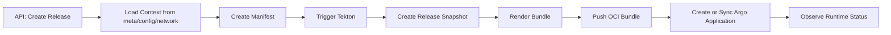

# 🧵 发布链路 Trace 示例

<span class="df-badge">release-service</span> <span class="df-badge">runtime-service</span> <span class="df-badge">trace_id</span> <span class="df-badge">devflow.release.id</span>

这页不是讲概念，而是回答一个更实际的问题：

> **当一次发布变慢或失败时，一条“可排障”的 Trace 到底应该长什么样？**

适合的读者：

- 想验证 release-service observability 是否打通的开发者
- 想知道 `devflow.*` 字段该挂在哪些 Span 上的维护者
- 想从 Trace 继续跳日志、跳指标排查问题的值班工程师

读完后，你应该能完成一件事：

> **对照一条发布 Trace，判断自己的发布链路字段是否足够支撑排障。**

---

## 🧭 先看 DevFlow 里的真实发布责任分界

一次发布并不是一个单服务动作，而是至少跨过这些责任边界：

- `release-service` 负责收集上下文、创建快照、推进状态机
- `meta-service` 提供项目、应用、环境、集群等元数据
- `config-service` 提供 WorkloadConfig 和 AppConfig
- `network-service` 提供 Service 和 Route
- `runtime-service` 提供 rollout 观察和运行时回写
- Tekton、Registry、Argo CD 负责构建和部署外部动作

如果 Trace 只能看到 `release-service` 自己，排障价值其实很有限。

---

## 🧭 再看一条理想的发布链路

一次典型发布，链路通常会跨过这些阶段：



如果 observability 接得足够完整，这些阶段应该出现在**同一条 Trace**里，而不是散落在多个互不关联的日志里。

---

## ✅ 根 Span 最少应该带什么

发布链路最重要的是入口 Span，也就是用户或系统真正发起发布请求的那一层。

### 推荐字段

| 字段 | 为什么需要 |
|------|------------|
| `trace_id` | 串起整条发布链路 |
| `service.name=release-service` | 明确入口服务 |
| `http.request.method` | 确认入口动作 |
| `http.route` | 确认入口 API |
| `devflow.project.id` | 识别项目 |
| `devflow.application.id` | 识别应用 |
| `devflow.environment.id` | 识别目标环境 |
| `devflow.release.id` | 识别这次发布 |

### 示例

```json
{
  "span.name": "POST /api/v1/release/releases",
  "service.name": "release-service",
  "http.request.method": "POST",
  "http.route": "/api/v1/release/releases",
  "devflow.project.id": "proj-001",
  "devflow.application.id": "app-123",
  "devflow.environment.id": "env-prod",
  "devflow.release.id": "rel-001"
}
```

如果根 Span 上连 `devflow.release.id` 都没有，后面即使子 Span 很多，也很难快速定位到“是哪次发布”。

---

## 🌳 推荐的 Span 树结构

下面是一棵更接近实际排障需求的 Span 树：

```text
POST /api/v1/release/releases
├── release.LoadApplicationContext
│   ├── meta-service.GetProject
│   ├── meta-service.GetApplication
│   ├── meta-service.GetEnvironment
│   ├── config-service.GetWorkloadConfig
│   ├── config-service.ListAppConfigs
│   ├── network-service.GetServices
│   └── network-service.GetRoutes
├── release.CreateManifest
├── tekton.TriggerPipelineRun
├── release.CreateReleaseSnapshot
├── release.RenderBundle
├── registry.PushBundle
├── argocd.CreateApplication
└── runtime-service.WatchReleaseStatus
```

### 这棵树的意义

- **上半段**说明 release-service 在收集上下文
- **中间段**说明它在创建 Manifest / Release、触发构建、渲染 bundle
- **下半段**说明它已经进入部署与观察阶段

如果链路停在某一层，你就知道故障大概落在哪一段。

---

## 🧩 哪些 Span 必须带业务字段

不是每个 Span 都要打满所有 `devflow.*`，但关键节点必须带。

| Span | 建议字段 |
|------|----------|
| 入口 API Span | `devflow.project.id` `devflow.application.id` `devflow.environment.id` `devflow.release.id` |
| `release.LoadApplicationContext` | `devflow.project.id` `devflow.application.id` `devflow.environment.id` |
| `release.CreateManifest` | `devflow.manifest.id` `devflow.application.id` |
| `tekton.TriggerPipelineRun` | `devflow.manifest.id` `devflow.release.id` `devflow.intent.kind=build` |
| `release.CreateReleaseSnapshot` | `devflow.release.id` `devflow.environment.id` |
| `release.RenderBundle` | `devflow.manifest.id` `devflow.release.id` |
| `registry.PushBundle` | `devflow.release.id` |
| `argocd.CreateApplication` | `devflow.release.id` `devflow.environment.id` |
| `runtime-service.WatchReleaseStatus` | `devflow.release.id` `devflow.application.id` |

最简单的原则：

- **定位发布对象**靠 `devflow.release.id`
- **定位构建快照**靠 `devflow.manifest.id`
- **定位目标环境**靠 `devflow.environment.id`
- **定位编排阶段**靠稳定的 span name 和生命周期日志

---

## 📜 一条失败发布应该怎样出日志

Trace 只是骨架，日志负责补细节。

假设失败点出在 `argocd.CreateApplication`，理想的关键日志应该像这样：

```json
{
  "timestamp": "2026-05-10T15:21:08Z",
  "severity_text": "ERROR",
  "logger.name": "release.lifecycle",
  "message": "failed to create argo application: permission denied",
  "caller": "release/service/release_executor.go:188",
  "trace_id": "2e71abb92e031efc2a7a1c4280959f4b",
  "span_id": "9fa312ab0044cd11",
  "operation": "create_argo_application",
  "resource": "release",
  "result": "error",
  "devflow.application.id": "app-123",
  "devflow.environment.id": "env-prod",
  "devflow.release.id": "rel-001"
}
```

这样的好处是：

- 从 Trace 能跳到这条日志
- 从日志也能反查这条 Trace
- 不看代码也知道失败发生在 Argo CD 创建阶段

---

## 🧪 一条“卡在 runtime 回写”的 Trace 应该长什么样

发布失败不一定发生在创建资源阶段，也可能发生在“资源已经下发，但 runtime 迟迟没有回写完成”。

这种情况下，更有价值的链路通常会长这样：

```text
POST /api/v1/release/releases
└── runtime-service.WatchReleaseStatus
    ├── runtime.ListWorkloads
    ├── runtime.ListPods
    ├── runtime.CheckRolloutProgress
    └── runtime.WriteReleaseStatusBack
```

如果这里看不到 `runtime-service` 的细分步骤，你通常只能知道“发布卡住了”，但不知道是：

- workload 还没更新
- Pod 没 Ready
- rollout condition 没达标
- 还是回写动作本身失败

---

## 📈 一条异常 Trace 应该怎样联动指标

如果 Canary 发布卡住，通常不是先从日志发现，而是先从指标发现：

1. Grafana 看到 `release-service` 错误率升高
2. 点击 exemplar 跳到异常 Trace
3. 在 Trace 里发现耗时集中在 `runtime-service.WatchReleaseStatus`
4. 再跳日志看具体是 Pod readiness 慢，还是 rollout condition 异常

所以相关指标至少应该能按这些维度聚合：

- `http_route`
- `http_response_status_code`

`service_name`、`service_namespace` 这类身份维度如果需要，也应优先来自 scrape target metadata、OTel Resource 或 Collector enrichment，而不是默认做成每条 HTTP 应用指标 label。

不建议把 `devflow.release.id` 直接打成高频 metrics label；它更适合留在 Trace 和 Logs 中。

---

## 🚨 三种最常见的坏味道

### 1. Trace 有了，但看不出是哪次发布

现象：

- 只能看到 `POST /api/v1/release/releases`
- 没有 `devflow.release.id`
- 没有 `devflow.application.id`

后果：

- 只能知道“发布接口慢了”
- 不能知道“是哪次发布慢了”

### 2. 子 Span 很多，但字段不一致

现象：

- 有的 Span 用 `releaseId`
- 有的 Span 用 `devflow.release.id`
- 日志又写成 `release_id`

后果：

- 查询条件碎裂
- 关联分析变差

### 3. 整条链路断在跨服务调用上

现象：

- 入口 Span 存在
- 调 meta-service / runtime-service 时开了新 Trace
- 看不到父子关系

后果：

- 无法判断时间真正耗在哪个下游步骤

### 4. 只有外部系统 Span，没有 DevFlow 内部阶段 Span

现象：

- 能看到 Tekton、Registry、Argo CD
- 看不到 `release.CreateManifest`、`release.RenderBundle`、`runtime-service.WatchReleaseStatus`

后果：

- 只能知道外部依赖慢
- 不能判断 DevFlow 自己的编排逻辑慢在哪里

---

## 🧪 最小验收方式

如果你想确认发布链路已经“能排障”，建议至少验这 6 步：

1. 发起一次真实 Release
2. 在 Trace 后端按 `service.name=release-service` 找入口 Span
3. 确认入口 Span 带有：
   - `devflow.application.id`
   - `devflow.environment.id`
   - `devflow.release.id`
4. 确认能看到至少 5 个关键子 Span：
   - `release.LoadApplicationContext`
   - `release.CreateManifest`
   - `tekton.TriggerPipelineRun`
   - `argocd.CreateApplication`
   - `runtime-service.WatchReleaseStatus`
5. 随机点一个失败或慢 Span，确认能按 `trace_id` 找到对应日志
6. 确认至少一个阶段性错误日志同时带有：
   - `trace_id`
   - `span_id`
   - `devflow.release.id`
   - `message`

如果这 6 步都能完成，这条链路就已经具备很强的排障价值。

---

## 关联阅读

- [发布生命周期](../../architecture/lifecycle/)
- [字段命名与来源边界](../contracts/attributes/)
- [结构化日志规范](../contracts/logging/)
- [现有服务字段清单](../service-checklist/)
- [OTel 接入检查清单](../onboarding-checklist/)
