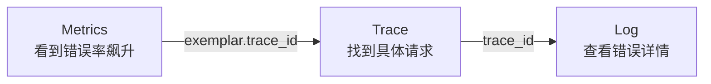

# 🏷️ 标签使用规范

 OTel Metrics Logs Traces

DevFlow 的 Metrics、Traces、Logs 需要能互相关联，但三者不是同一种东西。

- Metrics 负责错误率、流量、延迟、SLO 和告警
- Traces 负责请求链路、慢点定位、下游瓶颈
- Logs 负责错误文本、业务事件、panic 细节

本文档定义三种信号的标准 Labels / Attributes，并明确哪些字段适合做
metrics label，哪些字段只能留在 trace 或 log 中。

> **来源标注**：本文档中字段来源分为两类 — `🤖 OTel 自动`（SDK/Collector 自动注入，无需代码改动）和 `✍️ 手动添加`（需在代码中显式设置）。

## 🧭 先分清“在哪配置”

在 DevFlow 里，标签来源建议按三层理解：

| 层级 | 典型字段 | 配置位置 |
|------|----------|----------|
| 服务启动层 | `service.name` `service.version` | SDK Resource / 环境变量 |
| 服务代码层 | `devflow.*` `error.message` `db.operation` | Span / Log / Metric 代码 |
| Collector 层 | `deployment.environment` `k8s.*` `cloud.region` | OTel Collector processors |

如果你先关心“字段应该放哪”，优先看 [公共 Attributes](../attributes/)。

---

## 📈 Metrics（指标）标签

**用于统计和聚合指标数据，是主事实源**

### 必选 Labels

| Key | 类型 | 说明 | 示例 |
|-----|-----|-----|-----|
| `service_name` | string | 服务名称 | `meta-service` |
| `service_namespace` | string | 服务命名空间 | `devflow` |
| `deployment_environment_name` | string | 部署环境名 | `production` |
| `http_request_method` | string | HTTP 方法 | `GET` |
| `http_route` | string | 路由模板 | `/api/v1/releases/:id` |
| `http_response_status_code` | string | HTTP 状态码 | `200` |
| `http_response_status_class` | string | HTTP 状态类别 | `2xx` |

### 可选 Labels（受限）

| Key | 类型 | 说明 | 示例 |
|-----|-----|-----|----|
| `k8s.namespace.name` | string | K8s 命名空间 | `applications` |
| `k8s.pod.name` | string | Pod 名称 | `user-service-5c7d8b9d7f-xyz12` |
| `k8s.container.name` | string | 容器名称 | `user-service` |
| `k8s.node.name` | string | 节点名称 | `node-01` |
| `region` / `zone` | string | 地域 / 可用区 | `ap-southeast-1a` |

说明：

- `trace_id` 不能作为 metrics label
- Metrics 到 Trace 的关联应通过 exemplar，而不是高基数 label
- `devflow.release.id`、`request_id`、`user_id`、`url.path` 都不应进入高频 metrics label

### 不能作为标签的字段

有些字段不适合做标签，因为值太多会导致存储爆炸：

| 字段 | 为什么不行 |
|------|-----------|
| `user_id` | 用户可能有几千万，每个用户一条时间线 |
| `request_id` | 每个请求唯一，基数无限 |
| `ip_address` | IP 数量无界 |
| `trace_id` | 每个请求唯一，基数无限 |
| `release_id` | 发布频繁变化，会打碎高频时间序列 |
| `url.path` | 原始路径通常包含动态 ID，基数失控 |

这些字段应该放在 Logs 或 Traces 里，而不是 Metrics 标签里。

### Trace-derived metrics

Trace 可以派生出一部分 RED 指标，比如 request rate、5xx error rate、
latency histogram，典型做法是使用 OTel Collector 的 `spanmetrics`
connector。

但这类 trace-derived metrics 只能作为补充面，不能替代原生 metrics：

- 原生 metrics：主事实源，用于告警、SLO、长趋势
- trace-derived metrics：补充分析面，用于 trace-first 视角和关联排障

不要因为 Trace 里已经有 method / route / status / duration，就删除原生
HTTP metrics。

### Metric Value / Measurement

| Key | 类型 | 说明 | 示例 |
|-----|-----|-----|-----|
| `http.server.duration` | duration | 请求耗时 | `120ms` |
| `http.request.size` | bytes | 请求大小 | `2KB` |
| `http.response.size` | bytes | 响应大小 | `10KB` |

---

## 🔗 Traces（链路）标签

**用于分布式请求链路追踪和根因定位**

### Span Attributes

**Span 关注单次操作的上下文和状态，用于 Trace 追踪**

#### 必选

| Key | 类型 | 说明 | 示例 |
|-----|-----|-----|-----|
| `trace_id` | string | Trace ID，用于关联整个 Trace | `2e71abb92e031efc2a7a1c4280959f4b` |
| `span_id` | string | 当前 Span ID | `abc123def456` |
| `span.name` | string | Span 名称 | `Tekton.CreatePipelineRun` |
| `span.kind` | string | Span 类型 | `server` / `client` / `producer` / `consumer` |
| `span.status` | string | Span 状态 | `ok` / `error` |
| `span.duration` | duration | Span 耗时 | `120ms` |
| `http.request.method` | string | HTTP 方法 | `GET` |
| `http.route` | string | 路由模板 | `/users/:id` |
| `http.response.status_code` | int | HTTP 状态码 | `200` |
| `url.path` | string | 请求路径 | `/api/v1/users/123` |
| `url.scheme` | string | 协议 | `http` / `https` |

#### 可选

| Key | 类型 | 说明 | 示例 |
|-----|-----|-----|-----|
| `parent_span_id` | string | 父 Span ID | `xyz789ghi012` |
| `client.address` | string | 客户端 IP 或地址 | `10.0.0.1` |
| `server.address` | string | 服务端 IP 或地址 | `10.0.0.10` |
| `network.peer.address` | string | 网络对端地址 | `10.0.0.2` |
| `network.peer.port` | int | 网络对端端口 | `443` |
| `network.protocol.version` | string | 网络协议版本 | `HTTP/2` |
| `http.response.body.size` | int | 响应体大小 | `1024` |
| `error.message` | string | 错误信息（如有） | `database timeout` |
| `user_agent.original` | string | User-Agent | `curl/7.68.0` |

#### 业务上下文

| Key | 类型 | 说明 | 示例 |
|-----|-----|-----|-----|
| `devflow.application.id` | string | 涉及哪个应用 | `app-123` |
| `devflow.manifest.id` | string | 涉及哪个构建 | `mf-001` |
| `devflow.release.id` | string | 涉及哪个发布 | `rel-001` |

这样从链路里可以直接看到：这个请求在处理哪个应用的发布。

### Resource Attributes（Span 所属资源，如 Pod / VM / Node）

**表示 Span 或 Metric 所运行的物理/虚拟资源上下文，包括服务和 Kubernetes 信息**

#### 必选

| Key | 类型 | 说明 | 示例 |
|-----|-----|-----|-----|
| `service.name` | string | 服务名称 | `devflow` |
| `deployment.environment.name` | string | 部署环境 | `prod` / `staging` / `dev` |
| `k8s.cluster.name` | string | 集群名称 | `cluster-prod` |
| `k8s.namespace.name` | string | Pod 所在命名空间 | `applications` |
| `k8s.pod.name` | string | Pod 名称 | `devflow-12345` |
| `k8s.container.name` | string | 容器名称 | `devflow` |

#### 可选

| Key | 类型 | 说明 | 示例 |
|-----|-----|-----|-----|
| `service.namespace` | string | 服务命名空间（业务层） | `payments` |
| `service.instance.id` | string | 服务实例 ID 或 Pod 名称 | `devflow-abc123` |
| `service.version` | string | 服务版本 | `v1.2.3` |
| `k8s.node.name` | string | 节点名称 | `node-01` |
| `k8s.region` | string | 集群所在地域 | `ap-southeast-1` |
| `k8s.zone` | string | 集群可用区 | `ap-southeast-1a` |
| `k8s.host.id` | string | 节点/主机 ID | `i-0234abcd5678ef` |

---

## 📜 Logs（日志）标签

**用于记录系统或业务事件，不替代 Trace**

### 必选 Attributes

| Key | 类型 | 说明 | 示例 |
|-----|-----|-----|-----|
| `severity_text` | string | 日志级别 | `INFO` / `WARN` / `ERROR` |
| `body` | string | 日志内容 | `http request completed` |
| `logger.name` | string | 日志分类名 | `http.access` / `http.error` |
| `trace_id` | string | Trace ID（强烈建议） | `2e71abb92e031efc2a7a1c4280959f4b` |

### 可选 Attributes

| Key | 类型 | 说明 | 示例 |
|-----|-----|-----|-----|
| `caller` | string | 调试辅助字段 | `routercore/gin.go:180` |
| `span_id` | string | Span ID（可选） | `abc123def456` |
| `service.name` | string | 服务名称 | `user-service` |
| `service.namespace` | string | 服务命名空间 | `devflow` |
| `service.version` | string | 服务版本 | `sha256:03b4a60ec604` |
| `k8s.cluster.name` | string | 集群名称 | `cluster-prod` |
| `k8s.namespace.name` | string | Pod 所在命名空间 | `applications` |
| `k8s.pod.name` | string | Pod 名称 | `devflow-12345` |
| `k8s.container.name` | string | 容器名称 | `devflow` |
| `k8s.node.name` | string | 节点名称 | `node-01` |
| `k8s.region` | string | 集群所在地域 | `ap-southeast-1` |
| `k8s.zone` | string | 集群可用区 | `ap-southeast-1a` |
| `client.address` | string | 客户端地址 | `10.0.0.1` |
| `user_agent.original` | string | User-Agent | `curl/7.68.0` |
| `http.request.method` | string | HTTP 方法 | `GET` |
| `http.route` | string | 路由模板 | `/api/v1/releases/:id` |
| `url.path` | string | 实际路径 | `/api/v1/releases/123` |
| `http.response.status_code` | int | 状态码 | `500` |

### Value / Measurement

| Key | 类型 | 说明 | 示例 |
|-----|-----|-----|-----|
| `stacktrace` | string | 错误堆栈信息（可选） | `at main.go:45` |
| `duration_ms` | float | 请求耗时（毫秒） | `120.4` |

---

## 三者怎么关联

排查问题的典型路径：

1. Grafana 仪表盘看到错误率飙升（Metrics）
2. 点击指标上的 exemplar，跳转到对应 Trace
3. 从 Trace 找到具体服务，再跳转到该服务的 Log

三个系统通过统一的 `trace_id` 和服务维度串在一起。

