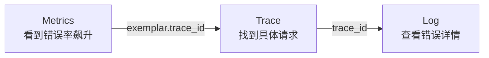

# 信号字段契约

Metrics Traces Logs Contract

DevFlow 的 Metrics、Traces、Logs 需要能关联，但它们不是同一种信号，也不应该承载同一份字段集合。

本文档定义三种信号的标准 labels / attributes，并明确哪些字段适合做
metrics label，哪些字段只能留在 trace 或 log 中。

这页主要解决一个问题：

> **每一种信号的完整字段契约到底是什么。**

如果你只想快速查“每种信号最少必须带什么字段”，优先看
[信号标签矩阵](../signal-label-matrix/)；这页保留的是完整字段契约。

---

## Metrics（指标）标签

Metrics 用于统计、聚合、告警、SLO，是主事实源。

### 高频 HTTP metrics 推荐 labels

| Key | 类型 | 说明 | 示例 |
|-----|-----|-----|-----|
| `service_name` | string | 服务名称 | `release-service` |
| `service_namespace` | string | 服务命名空间 | `devflow` |
| `http_request_method` | string | HTTP 方法 | `GET` |
| `http_route` | string | 路由模板 | `/api/v1/releases/:id` |
| `http_response_status_code` | string | HTTP 状态码 | `200` |
| `http_response_status_class` | string | HTTP 状态码段 | `2xx` / `4xx` / `5xx` |

说明：

- `http_response_status_class` 是当前 DevFlow HTTP 高频 metrics 的必需 label，SLO、错误率和平台仪表盘都依赖它。
- `deployment_environment_name` 不是所有高频 HTTP metrics 的必选 label，是否暴露取决于当前采集实现和成本控制。

### 低频或场景化 labels

这些字段只有在基数受控、业务确实需要聚合时才考虑使用：

- `service_version`
- `result`
- `action`
- `strategy`
- `pipeline_type`
- `observer_type`
- `callback_type`
- `task_name`

### 禁止放进高频 metrics label 的字段

有些字段不适合做标签，因为值太多会导致存储爆炸：

| 字段 | 为什么不行 |
|------|-----------|
| `user_id` | 用户可能有几千万，每个用户一条时间线 |
| `request_id` | 每个请求唯一，基数无限 |
| `client.address` | 地址数量无界，不适合做高频 label |
| `trace_id` | 每个请求唯一，基数无限 |
| `release_id` | 发布频繁变化，会打碎高频时间序列 |
| `url.path` | 原始路径通常包含动态 ID，基数失控 |
| `span_id` | 每个 span 唯一，基数无限 |
| `manifest_id` | 高频变化，适合放 Trace / Log / DB |
| `error.message` | 文本无界，无法聚合 |

这些字段应该放在 Logs 或 Traces 里，而不是 Metrics 标签里。Metrics 到 Trace 的关联应通过 exemplar，而不是把 `trace_id` 放成 label。

### Trace-derived metrics

Trace 可以派生出一部分 RED 指标，比如 request rate、5xx error rate、latency histogram，典型做法是使用 OTel Collector 的 `spanmetrics` connector。

但这类 trace-derived metrics 只能作为补充面，不能替代原生 metrics。不要因为 Trace 里已经有 method / route / status / duration，就删除原生 HTTP metrics。

### 典型指标值

| Key | 类型 | 说明 | 示例 |
|-----|-----|-----|-----|
| `http_server_requests_total` | counter | 请求计数 | `10234` |
| `http_server_request_duration_seconds` | histogram | 请求耗时 | `0.1204` |
| `http_request_size_bytes` | histogram / summary | 请求大小 | `2048` |
| `http_response_size_bytes` | histogram / summary | 响应大小 | `10240` |

---

## Traces（链路）标签

Traces 用于单次请求链路、慢点定位、下游瓶颈分析。

### Span Attributes

#### 核心 span attributes

| Key | 类型 | 说明 | 示例 |
|-----|-----|-----|-----|
| `trace_id` | string | Trace ID，用于关联整个 Trace | `2e71abb92e031efc2a7a1c4280959f4b` |
| `span_id` | string | 当前 Span ID | `abc123def456` |
| `span.name` | string | Span 名称 | `Tekton.CreatePipelineRun` |
| `span.kind` | string | Span 类型 | `server` / `client` / `producer` / `consumer` |
| `service.name` | string | 服务名称 | `release-service` |
| `service.namespace` | string | 服务命名空间 | `devflow` |
| `http.request.method` | string | HTTP 方法 | `GET` |
| `http.route` | string | 路由模板 | `/users/:id` |
| `http.response.status_code` | int | HTTP 状态码 | `200` |
| `url.path` | string | 请求路径 | `/api/v1/users/123` |
| `url.scheme` | string | 协议 | `http` / `https` |

#### 常见可选 attributes

| Key | 类型 | 说明 | 示例 |
|-----|-----|-----|-----|
| `parent_span_id` | string | 父 Span ID | `xyz789ghi012` |
| `client.address` | string | 客户端 IP 或地址 | `10.0.0.1` |
| `server.address` | string | 服务端 IP 或地址 | `10.0.0.10` |
| `network.peer.address` | string | 网络对端地址 | `10.0.0.2` |
| `network.peer.port` | int | 网络对端端口 | `443` |
| `network.protocol.version` | string | 网络协议版本 | `HTTP/2` |
| `http.response.body.size` | int | 响应体大小 | `1024` |
| `error.message` | string | 错误信息（如有） | `database timeout` |
| `user_agent.original` | string | User-Agent | `curl/7.68.0` |

#### 业务上下文

| Key | 类型 | 说明 | 示例 |
|-----|-----|-----|-----|
| `devflow.application.id` | string | 涉及哪个应用 | `33c58c47-...` |
| `devflow.manifest.id` | string | 涉及哪个构建 | `f93ba63d-...` |
| `devflow.release.id` | string | 涉及哪个发布 | `ea48bef3-...` |

### Resource Attributes

#### 常见资源字段

| Key | 类型 | 说明 | 示例 |
|-----|-----|-----|-----|
| `service.name` | string | 服务名称 | `release-service` |
| `deployment.environment.name` | string | 部署环境 | `production` / `pre-production` |
| `k8s.cluster.name` | string | 集群名称 | `cluster-prod` |
| `k8s.namespace.name` | string | Pod 所在命名空间 | `devflow` |
| `k8s.pod.name` | string | Pod 名称 | `devflow-12345` |
| `k8s.container.name` | string | 容器名称 | `devflow` |

#### 可选资源字段

| Key | 类型 | 说明 | 示例 |
|-----|-----|-----|-----|
| `service.namespace` | string | 服务命名空间（业务层） | `payments` |
| `service.instance.id` | string | 服务实例 ID 或 Pod 名称 | `devflow-abc123` |
| `service.version` | string | 服务版本 | `2026.05.11` |
| `k8s.node.name` | string | 节点名称 | `node-01` |
| `k8s.region` | string | 集群所在地域 | `ap-southeast-1` |
| `k8s.zone` | string | 集群可用区 | `ap-southeast-1a` |
| `k8s.host.id` | string | 节点/主机 ID | `i-0234abcd5678ef` |

---

## Logs（日志）标签

Logs 用于记录错误文本、业务事件、状态变化，不替代 Trace。

### 基础字段

| Key | 类型 | 说明 | 示例 |
|-----|-----|-----|-----|
| `timestamp` | string | 日志时间 | `2026-05-11T08:00:00Z` |
| `severity_text` | string | 日志级别 | `INFO` / `WARN` / `ERROR` |
| `message` | string | 日志内容 | `http request completed` |
| `logger.name` | string | 日志分类名 | `http.access` / `http.error` |
| `caller` | string | 调试辅助字段 | `routercore/gin.go:180` |
| `trace_id` | string | Trace ID（必需） | `2e71abb92e031efc2a7a1c4280959f4b` |
| `span_id` | string | Span ID（必需） | `abc123def456` |

### 常见字段

| Key | 类型 | 说明 | 示例 |
|-----|-----|-----|-----|
| `service.name` | string | 服务名称 | `release-service` |
| `service.namespace` | string | 服务命名空间 | `devflow` |
| `service.version` | string | 服务版本 | `2026.05.11` |
| `k8s.cluster.name` | string | 集群名称 | `cluster-prod` |
| `k8s.namespace.name` | string | Pod 所在命名空间 | `devflow` |
| `k8s.pod.name` | string | Pod 名称 | `devflow-12345` |
| `k8s.container.name` | string | 容器名称 | `devflow` |
| `k8s.node.name` | string | 节点名称 | `node-01` |
| `http.request.method` | string | HTTP 方法 | `GET` |
| `http.route` | string | 路由模板 | `/api/v1/releases/:id` |
| `url.path` | string | 实际路径 | `/api/v1/releases/123` |
| `http.response.status_code` | int | 状态码 | `500` |

说明：

- `service.*` 和 `deployment.environment.name` 优先作为资源属性存在，不要求每条普通请求日志重复。
- `logger.name` 是日志分类主键；`caller` 只是源码定位字段，二者不能互相替代。
- `caller` 仅用于调试，不允许作为 metrics label、Loki stream label、Grafana variable。
- `http.access` / `http.error` 当前有意保持极简。
- `trace_id` 和 `span_id` 是 Trace -> Log 关联主键，新日志契约里应视为必需字段。

如果错误日志需要更具体的失败文本，优先直接写进 `message`，而不是再引入新的自由文本日志字段。

---

## 这页不解决什么

这页不负责两类问题：

- 不负责解释字段该由服务代码、OTel SDK 还是 Collector 注入
  - 这部分看 [字段命名与来源边界](../attributes/)
- 不负责给出最小必需字段速查表
  - 这部分看 [信号标签矩阵](../signal-label-matrix/)

### 日志专属测量字段

| Key | 类型 | 说明 | 示例 |
|-----|-----|-----|-----|
| `duration_ms` | float | 操作耗时（毫秒） | `120.4` |

---

## 三者怎么关联

排查路径通常是：先看 Metrics，再通过 exemplar 进入 Trace，最后按 `trace_id` 进入 Log。

