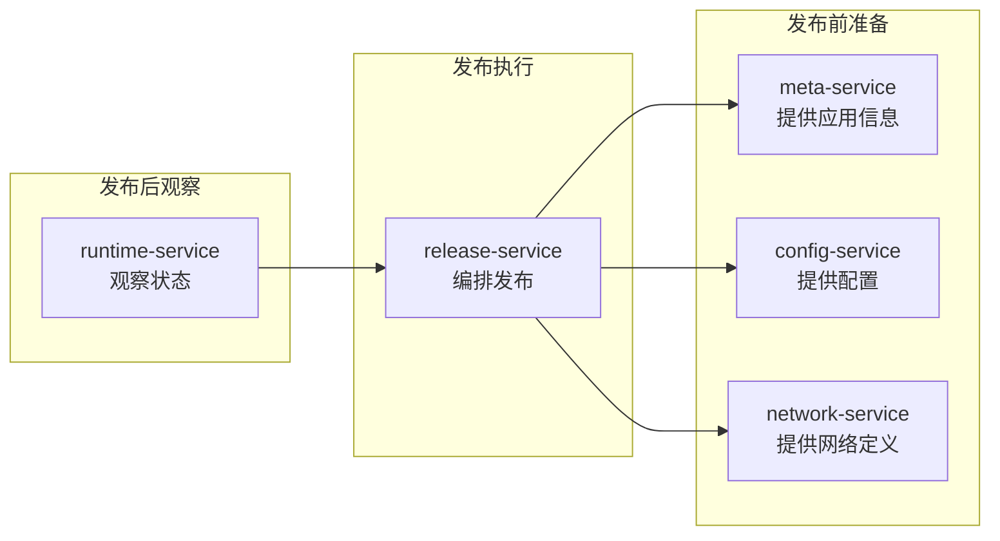

# 服务详解

DevFlow 由 5 个微服务组成。你可以把它们理解成一个团队里的 5 个角色，各有分工，协同完成一次应用发布。

| 服务 | 角色比喻 | 核心职责 |
|------|---------|---------|
| [meta-service](meta-service/) | 档案管理员 | 管理所有应用的"户口本" |
| [config-service](config-service/) | 配置专员 | 管理应用配置和环境差异 |
| [network-service](network-service/) | 网络工程师 | 管理服务的网络拓扑和入口规则 |
| [release-service](release-service/) | 发布经理 | 编排发布全流程 |
| [runtime-service](runtime-service/) | 运维值班 | 实时观察集群状态，执行运维操作 |

---

## 它们怎么协作

一次典型的发布流程：

1. **release-service** 说："我要发布 payment-gateway 到生产环境"
2. **meta-service** 说："payment-gateway 的代码仓库是 xxx，生产环境在 cluster-beijing"
3. **config-service** 说："它的基础配置是 3 个副本、1Gi 内存，生产环境的特殊配置是数据库地址 xxx"
4. **network-service** 说："它暴露了 80 端口，生产环境的域名是 payment.example.com"
5. **release-service** 把这些信息打包成快照，触发构建和部署
6. **runtime-service** 实时观察集群，告诉 release-service："新版本 Pod 已经全部 Ready 了"

---

## 为什么拆成 5 个服务

你可能会问：为什么不能做成一个大服务？

原因很简单：**不同部分的变更频率和扩展需求不一样**。

| 服务 | 变更频率 | 为什么需要独立 |
|------|---------|--------------|
| meta-service | 低 | 元数据相对稳定，独立出来不会频繁重启 |
| config-service | 中 | 配置变更多，需要独立扩展 |
| network-service | 中 | 网络策略复杂，独立管理更安全 |
| release-service | 高 | 发布逻辑最复杂，迭代最快 |
| runtime-service | 高 | 查询量最大，需要水平扩展 |

拆成 5 个服务后，你可以：
- 独立升级某个服务，不影响其他服务
- 按负载分别扩展（runtime-service 通常需要更多的实例）
- 某个服务出问题，不会拖垮整个平台
